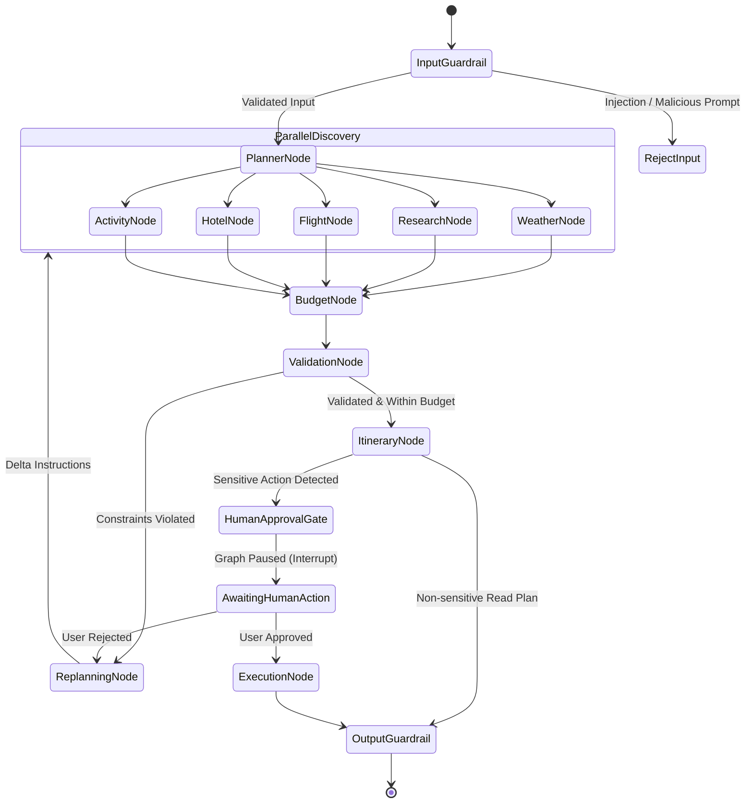
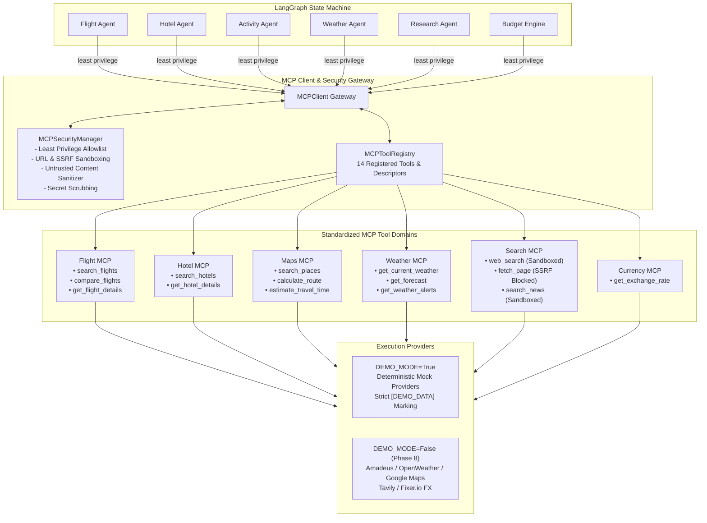
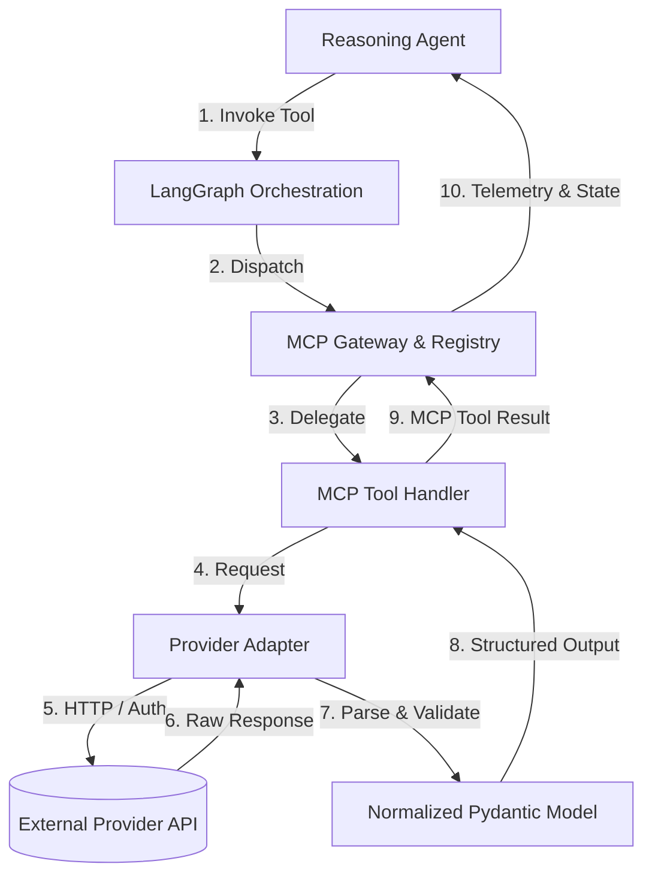
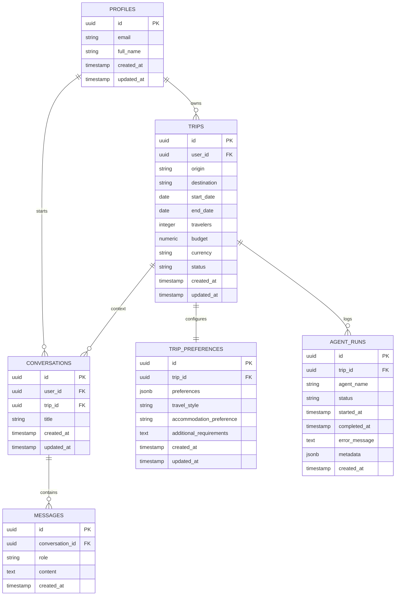
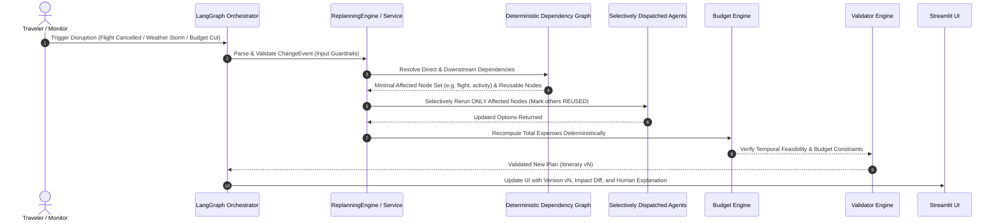
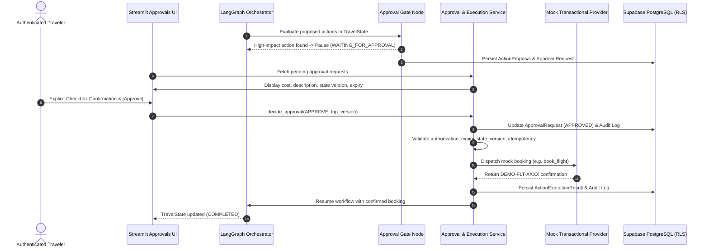
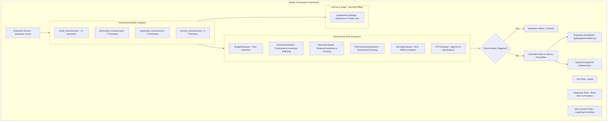

# System Architecture: Multi-Agent AI Travel Intelligence & Dynamic Replanning Platform

## 1. Overall System Architecture

The platform follows a layered, decoupled architecture designed for high availability, verifiable correctness, and modular scalability.


---

## 2. Production Travel Command Center UI/UX Architecture

The frontend is an enterprise-grade **Travel Command Center** built with Streamlit and a custom vanilla CSS design system, avoiding chatbot gimmicks and delivering actionable flight, hotel, and intelligence cockpits.

### 2.1 Information Architecture & Navigation
The platform splits navigation into a two-tier taxonomy:

```
├── 🧭 PRIMARY NAVIGATION (Traveler Cockpit)
│   ├── 1. 📊 Dashboard                 - Active trip, 9-stage planning matrix, pending approvals, recent replans
│   ├── 2. ➕ New Trip                  - Multi-step trip creation with 10 preference dimensions & pace constraints
│   ├── 3. 🧳 My Trips                  - Historical itineraries, status filters, and one-click trip switching
│   ├── 4. 📍 Current Trip              - Deep inspection of route, schedule, constraints, and quick actions
│   ├── 5. 🗓️ Itinerary                 - Structured Day/Morning/Afternoon/Evening cards with versioning (v1, v2)
│   ├── 6. ✈️ Flights                   - Cabin class, duration, stops, pricing, and DEMO/LIVE provenance tags
│   ├── 7. 🏨 Hotels                    - Star ratings, amenities, nightly rates, and budget impact percentages
│   ├── 8. 🎭 Activities                - Timing, duration, transit times, weather suitability, deduplicated
│   ├── 9. ⛅ Weather                   - High/low °C, precipitation probability, humidity, and active advisories
│   ├── 10. 💰 Budget                   - Deterministic 6-category breakdown, utilization bar, and threshold badges
│   ├── 11. 🌐 Sources                  - Trust hierarchy (OFFICIAL, NEWS, REFERENCE, COMMUNITY, UNKNOWN)
│   └── 12. ⏳ Planning Progress        - Real-time pipeline state (Trip Request -> Requirements -> Planner -> ...)
│
└── 🛠️ DEVELOPER & ADVANCED (Intelligence & Safety Controls)
    ├── 13. 🔬 Agent Trace              - Multi-node execution logs, latency profiling, token counts, and cost
    ├── 14. 🔄 Changes & Replanning     - Event disruption timeline, node reuse tags (RERUN, REUSED, INVALIDATED)
    ├── 15. 🛡️ Approvals                - Human-in-the-Loop approval cards, risk levels, and expiry countdowns
    ├── 16. 🧪 Evaluation               - 31-scenario regression benchmark across Quality, Reliability, and Security
    ├── 17. 🧠 Knowledge / RAG          - Verified domain dossiers, chunk metrics, and live semantic search sandbox
    ├── 18. 🔒 Security                 - 10-layer defense matrix (Guardrails, RLS, SSRF, Secret Redaction, HITL)
    └── 19. ⚙️ Settings                 - Safe environment toggles, active model identifiers, zero leaked secrets
```

### 2.2 Design System & Visual Tokens
- **Theme**: Premium dark aesthetic (`#0F172A` Slate background, `#1E293B` Card background, `#334155` Borders).
- **Cards (`.travel-card`)**: Consistent padding, subtle border radius, hover lift micro-interactions.
- **Badges**:
  - `badge-demo`: Gold outline denoting deterministic sandboxed mock data.
  - `badge-live`: Green badge denoting authenticated live third-party API data.
  - `badge-completed`, `badge-running`, `badge-warning`, `badge-failed`, `badge-approval`.
- **Authoritative Backend Validation**: UI strictly never computes budgets or authorizes bookings. Backend rules remain authoritative; UI is not a security boundary.
- **Secret Redaction**: Zero API keys, passwords, or session tokens exposed in any UI component or trace.

---

## 3. LangGraph Architecture

LangGraph orchestrates the multi-agent system as a **Stateful Directed Acyclic/Cyclic Graph** with explicit checkpoints.



### 3.1 Multi-Agent & Deterministic Workflow Engine (Phases 5 & 6)

The LangGraph state machine orchestrates concurrent specialized domain agents followed by deterministic calculation and validation engines:


#### Core Components & Architectural Principles
1. **Shared State Architecture (`TravelState`)**:
   - Specialized agents **never directly invoke one another**. All state transfer, findings, and metadata are mediated exclusively through the centralized `TravelState`.
   - Distinct domain keys (`flight_options`, `hotel_options`, `activities`, `weather`, `research_results`, `budget_breakdown`, `validation_results`) ensure zero concurrent write collisions during parallel fan-out.
   - Shared diagnostic arrays (`agent_runs`, `warnings`, `errors`) utilize `Annotated[List[...], operator.add]` reducers for thread-safe state accumulation.
2. **Parallel Fan-Out & Convergence**:
   - Once requirements are validated, LangGraph triggers `Flight`, `Hotel`, `Activity`, and `Weather` in parallel.
   - All 4 branches converge into the `Research` node, which compiles destination cultural intelligence.
   - The workflow then pipes sequentially into `BudgetEngine` and `ValidatorEngine`.
3. **Deterministic Financial Calculation (Zero LLM Arithmetic)**:
   - **Why LLMs are NOT used for math**: Probabilistic language models hallucinate arithmetic sums, round unpredictably, and fail financial precision constraints.
   - All cost calculations (`flights + hotels + activities + food + transport + misc`) are executed in pure Python floating-point math in `BudgetEngine`.
   - Supports **STRICT budget strategy**: if `total_estimated_cost > budget`, marks `within_budget = False`, computes exact currency variance, and flags `OVER_BUDGET`.
4. **Deterministic Feasibility & Time-Conflict Validation**:
   - **Why LLMs are NOT used for validation**: LLM-based constraint checking is nondeterministic, prone to sycophancy, and susceptible to prompt injection.
   - `ValidatorEngine` applies deterministic Python rules:
     - *Dates*: Enforces positive durations, valid ISO strings, and date ordering (`end_date >= start_date`). Supports flexible unpinned dates with non-fatal warnings.
     - *Travelers*: Enforces positive integer headcounts (`travelers >= 1`).
     - *Flights*: Rejects flights where departure is at or after arrival (`departure < arrival`).
     - *Hotels*: Validates non-negative nightly rates and stay durations.
     - *Activities*: Identifies duplicate activities and flags travel-time conflicts (`POSSIBLE_TIME_CONFLICT`) when flight arrivals buffer insufficiently with activity starts.
     - *Weather*: Audits presence of meteorological feeds; flags `WEATHER_UNAVAILABLE` on agent failure without fabricating forecasts.
5. **Validation Severity Hierarchy & Workflow Transitions**:
   - `INFO`: Informational state notice (e.g. `DEMO_DATA_ACTIVE`).
   - `WARNING`: Non-fatal advisory (e.g. `OVER_BUDGET`, `WEATHER_UNAVAILABLE`, `POSSIBLE_TIME_CONFLICT`, `CURRENCY_MISMATCH`). Workflow transitions to `READY_WITH_WARNINGS`.
   - `ERROR`: Critical blocking invalidity (e.g. `INVALID_DATE_ORDER`, `INVALID_TRAVELER_COUNT`, `NEGATIVE_BUDGET`). Workflow transitions to `VALIDATION_FAILED`.
   - When 0 errors and 0 warnings exist: transitions to `READY_FOR_ITINERARY`.
6. **Failure Isolation & `DEMO_DATA` Boundaries**:
   - All executions are wrapped with `execute_agent_safely` in `agents/base_agent.py`. Individual agent failures do not crash the pipeline.
   - All mock deliverables explicitly carry `demo_data: True` and clear source attributions (`[DEMO_DATA]`). Live tool integrations (MCP) arrive in Phase 7.

### 3.2 Graph Structural Design
- **Deterministic Routing**: Conditional edges check typed flags in the graph state rather than relying on LLM routing decisions for state transitions.
- **Cycle Prevention**: Loop protection limits (`MAX_GRAPH_STEPS = 10`) guarantee termination; retries on LLM parsing failures are strictly bounded to `MAX_PLANNER_RETRIES = 2`.
- **State Checkpointing**: Every node transition creates a persistent snapshot in the Supabase/Memory checkpointer, enabling seamless crash recovery and human approval suspension.

---

## 4. Agent Responsibilities & Division of Labor

The system enforces a strict boundary between **Agent Reasoning** and **Deterministic Calculation**:

| Component | Nature | Technologies | Role & Boundaries |
|-----------|--------|--------------|-------------------|
| **Planner Agent** | Probabilistic (LLM) | GPT-4o / Claude 3.5 Sonnet | Deconstructs user prompt into a structured `TripRequirementSpec`; identifies constraints, preferences, and tradeoffs. |
| **Flight Agent** | Probabilistic + Tool | LLM + Flight Tools | Identifies viable flight corridors, compares transit durations, filters baggage options, selects best candidate flights. |
| **Hotel Agent** | Probabilistic + Tool | LLM + Hotel Tools | Evaluates lodging alternatives considering proximity to attractions, ratings, and price bands. |
| **Activity Agent** | Probabilistic + Tool | LLM + Places/RAG Tools | Curates cultural, leisure, and dining experiences respecting user pacing and travel style. |
| **Weather Agent** | Hybrid | LLM + Weather Tool | Fetches forecast and seasonal patterns; flags outdoor risk factors for the Planner. |
| **Research Agent** | Hybrid | LLM + RAG + Web Search | Queries destination guidelines (visas, local customs, transit passes, seasonal alerts). |
| **Budget Engine** | **Deterministic (Python)** | **Pure Python** | **Calculates exact totals, taxes, currency conversions, contingency buffers. Zero LLM math.** |
| **Validator Engine** | **Deterministic (Python)** | **Pure Python** | **Verifies timing feasibility, minimum connection times, open hours, pace fatigue indices.** |
| **Replanner Agent** | Probabilistic (LLM) | GPT-4o / Fast LLM | Formulates delta correction instructions when budget or validation engines flag an issue. |
| **Itinerary Agent** | Probabilistic (LLM) | GPT-4o | Synthesizes all approved components into a cohesive, narrative day-by-day itinerary. |

---

## 5. LangGraph State Schema

The graph operates on an immutable, strongly-typed state model governed by Pydantic v2:

```python
from typing import TypedDict, List, Dict, Optional, Any
from pydantic import BaseModel, Field

class TripState(TypedDict):
    # Workflow Metadata
    session_id: str
    user_id: str
    trip_id: str
    replan_count: int
    current_status: str
    
    # User Inputs & Extracted Spec
    user_prompt: str
    trip_spec: Dict[str, Any]             # Serialized TripRequirementSpec
    
    # Agent Candidate Outputs
    weather_data: Optional[Dict[str, Any]]
    research_insights: List[Dict[str, Any]]
    flight_options: List[Dict[str, Any]]
    selected_flights: Optional[Dict[str, Any]]
    hotel_options: List[Dict[str, Any]]
    selected_hotel: Optional[Dict[str, Any]]
    activity_options: List[Dict[str, Any]]
    selected_activities: List[Dict[str, Any]]
    
    # Deterministic Evaluation Results
    budget_breakdown: Optional[Dict[str, Any]]   # Total, transport, lodging, activities, contingency
    budget_approved: bool
    budget_overrun_amount: float
    
    validation_passed: bool
    validation_issues: List[Dict[str, Any]]      # Detailed feasibility or safety warnings
    
    # Replanning & Disruption Context
    disruption_event: Optional[Dict[str, Any]]
    replanning_instructions: Optional[str]
    
    # Human-in-the-Loop Approval State
    requires_human_approval: bool
    approval_type: Optional[str]                 # "booking", "cancellation", "budget_override"
    approval_payload: Optional[Dict[str, Any]]
    is_approved: Optional[bool]
    
    # Final Output
    final_itinerary: Optional[Dict[str, Any]]
    error_message: Optional[str]
```

---

## 6. Model Context Protocol (MCP) Architecture (Phase 7 Implemented)

The platform adopts the **Model Context Protocol (MCP)** to standardize agent-to-tool integration, decoupling probabilistic reasoning agents from external APIs and infrastructure capabilities.



### 6.1 Architectural Role Separation

The platform establishes distinct, non-overlapping architectural roles:

- **Agent = Reasoning & Decision Making**: Probabilistic intelligence evaluating constraints, assessing trade-offs, and coordinating domain objectives.
- **MCP = Standardized Capability & Tool Access**: Strongly-typed protocol layer abstracting third-party capabilities, input schemas, and execution boundaries.
- **Python = Deterministic Business Logic**: Pure Python arithmetic, temporal feasibility checks, and budget auditing with zero LLM math or hallucination risk.
- **LangGraph = Stateful Orchestration**: Graph state machine coordinating parallel fan-out, fan-in convergence, retries, and checkpointing.
- **Supabase = Persistent Storage & Security**: PostgreSQL persistence, Row Level Security (RLS), and JWT authentication.
- **RAG = Curated Knowledge Retrieval**: Vector similarity search over static travel guides, cultural norms, and destination documentation.
- **Web Search = Fresh Dynamic Information**: Sandboxed external search querying real-time conditions, events, and seasonal updates.

### 6.2 MCP vs Direct API Integration vs Normal Function Calling

| Evaluation Dimension | Direct API Integration | Normal Function Calling | Model Context Protocol (MCP) |
|----------------------|------------------------|-------------------------|------------------------------|
| **Coupling** | High: Agents depend directly on provider SDKs (e.g. Amadeus client). | Medium: Agents depend on local in-repo helper functions. | **Zero**: Agents interact via standard tool protocol interfaces. |
| **Provider Swapping** | Hard: Refactoring agent logic when migrating from Mock to Amadeus or Sabre. | Medium: Requires rewriting internal helper functions. | **Trivial**: Change tool descriptor backend without altering agent logic. |
| **Security Boundaries** | Poor: API tokens exposed in agent execution memory. | Inconsistent: Ad-hoc validation across helper scripts. | **Strict**: Centralized least-privilege allowlists, URL sandboxing, SSRF blocking. |
| **Observability** | Ad-hoc custom logging per provider. | Inconsistent function return structures. | **Uniform**: Standardized execution ID, latency, retry count, and masked telemetry. |
| **Multi-Language / Remote** | Tied to Python runtime. | In-process Python only. | Extensible across language boundaries and remote microservices. |

### 6.3 Tool Permission Model & Least Privilege Matrix

No agent has automatic or universal access to all tools. Invoking an unauthorized tool immediately triggers a `PERMISSION_DENIED` execution error without invoking provider logic:

```python
AGENT_TOOL_PERMISSIONS = {
    "flight": {"search_flights", "compare_flights", "get_flight_details"},
    "hotel": {"search_hotels", "get_hotel_details"},
    "activity": {"search_places", "calculate_route", "estimate_travel_time"},
    "weather": {"get_current_weather", "get_forecast", "get_weather_alerts"},
    "research": {"web_search", "fetch_page", "search_news"},
    "budget": {"get_exchange_rate"},
    "validator": {"estimate_travel_time", "get_exchange_rate"},
}
```

*Explicitly prohibited operations*: Booking, payments, booking cancellations, shell execution, arbitrary code execution, and arbitrary URL downloads are strictly prohibited across all agents.

### 6.4 Security Boundaries & Sandboxing

1. **Input & Argument Validation**: Every tool enforces Pydantic v2 schemas. Missing or malformed parameters are rejected with structured `INVALID_ARGUMENTS` errors.
2. **SSRF & Private IP Blocking**: `FetchPageInput` rejects any non-HTTP(S) protocol and blocks private subnets (`127.0.0.1`, `localhost`, `0.0.0.0`, `10.x.x.x`, `192.168.x.x`, `169.254.x.x`).
3. **Untrusted Web Content Sanitization**: All content retrieved via Search MCP tools is tagged `untrusted: True`. Text is stripped of script tags, style blocks, and sanitized against prompt injection patterns (`ignore previous instructions`, `system prompt`, `developer mode`).
4. **Secret Scrubbing in Telemetry**: Telemetry payloads automatically mask sensitive credentials (`api_key`, `secret`, `token`, `password`, `authorization`) with `[MASKED_SECRET]`.

### 6.5 Failure Isolation & Resiliency

MCP tool failures do not crash the LangGraph workflow:
- Errors return structured `ToolExecutionError` with `tool_name`, `error_code`, `message`, `retryable`, and `execution_id`.
- The invoking agent isolates the tool failure, records diagnostic warnings in state, falls back to deterministic models if available, and allows the remaining parallel agents to proceed unimpeded.

---

## 7. Real API / Provider Adapter Architecture (Phase 8 Implemented)

### 7.1 Provider Integration Architecture & Information Flow

The platform enforces a strict architectural boundary: **Agents never directly call external APIs**. All external network communications occur through dedicated provider adapters encapsulated behind MCP tools:



### 7.2 Integrated Provider Ecosystem

| Capability Domain | Real Provider Adapter | Protocol / Endpoint | Auth & Credentials | DEMO Mode Fallback |
|---|---|---|---|---|
| **Foreign Exchange** | `CurrencyProvider` (Frankfurter) | REST: `api.frankfurter.dev/v1/latest` | Open / Keyless (European Central Bank) | Deterministic `USD_BASE_RATES` table |
| **Climatology & Forecasts** | `WeatherProvider` (Open-Meteo) | REST: `api.open-meteo.com/v1/forecast` | Open / Keyless (WMO 7-14 day forecast) | Deterministic seasonal weather cycle |
| **Places & POI Discovery** | `MapsProvider` (Photon / OSM) | REST: `photon.komoot.io/api` | Open / Keyless (OpenStreetMap POIs) | Curated architectural landmarks catalog |
| **Corridor Routing & Transit** | `MapsProvider` (OSRM) | REST: `router.project-osrm.org/route/v1` | Open / Keyless (OSRM driving/transit) | Speed-factor transit matrix |
| **Live Knowledge & Search** | `SearchProvider` (Wikipedia & Tavily) | REST: `en.wikipedia.org/w/api.php` | Keyless Wikipedia; `TAVILY_API_KEY` (opt) | Sandboxed travel guidance snippets |
| **Aviation Corridors** | `FlightProvider` (Amadeus GDS) | REST: `test.api.amadeus.com/v2/shopping` | OAuth2: `AMADEUS_CLIENT_ID` + Secret | Deterministic global GDS catalog |
| **Hospitality Search** | `HotelProvider` (Amadeus Hospitality) | REST: `test.api.amadeus.com/v1/reference-data` | OAuth2: `AMADEUS_CLIENT_ID` + Secret | Curated hotel aggregator index |

### 7.3 Timeouts, Retries, and Error Classification

Every external provider request is executed via `BaseProvider.execute_http_request()`:
- **Explicit Timeout Ceilings**: 5.0s to 8.0s hard timeout per HTTP call (preventing hanging agent threads).
- **Bounded Exponential Backoff**: Maximum 2 retries (`attempt = 0, 1, 2`) with jittered backoff delay (`0.3s * 2^attempt`).
- **Error Classification**:
  - *Retryable Errors*: `ProviderTimeoutError`, `ProviderNetworkError` (transport/DNS failure, HTTP 5xx), `ProviderRateLimitError` (HTTP 429).
  - *Non-Retryable Errors*: `ProviderConfigurationError` (missing credentials in LIVE mode), `ProviderAuthenticationError` (HTTP 401/403), `ProviderResponseValidationError` (malformed schema), client errors (400-499).
- **Rate Limit Backoff**: Automatically reads `Retry-After` header on HTTP 429 responses, pauses execution up to a safety ceiling (3.0s), and logs throttled provider events without infinite loops.

### 7.4 In-Memory TTL Caching Policy

To prevent redundant API consumption and mitigate third-party rate limits, `ProviderCache` provides thread-safe in-memory caching:
- **Currency Rates**: TTL = 3,600 seconds (1 hour). Exchange rates change slowly during planning sessions.
- **Weather Forecasts**: TTL = 600 seconds (10 minutes).
- **Spatial Places & Routes**: TTL = 3,600 seconds (1 hour).
- **Web Search Queries**: TTL = 900 seconds (15 minutes).
- **Flight & Hotel Queries**: TTL = 1,800 seconds (30 minutes).
- *Strict Rule*: Real-time seat availability locks are never cached; caching only applies to initial discovery queries.

### 7.5 Untrusted Data Isolation & Security

1. **Third-Party Data Sanitization**: All external web data is treated as **UNTRUSTED DATA**:
   - Stripped of `<script>`, `<style>`, and raw HTML tags.
   - Neutralized against prompt injection patterns (`ignore previous instructions`, `developer mode`, `system prompt`).
   - Length-capped at 3,000 characters before delivery to reasoning models.
2. **SSRF & Address Filtering**: `fetch_page` forbids loopbacks (`127.0.0.1`, `localhost`), link-local metadata services (`169.254.169.254`), and private subnets (`10.0.0.0/8`, `192.168.0.0/16`, `172.16.0.0/12`).
3. **Zero Secret Leakage**:
   - Credentials originate exclusively from environment variables.
   - Outbound HTTP headers automatically redact `Authorization`, `X-Api-Key`, tokens, and passwords (`[REDACTED_SECRET]`).
   - Audit telemetry logs sanitize all parameter maps with `[MASKED_SECRET]`.

### 7.6 Source Attribution & Telemetry

All provider responses record provenance metadata for end-user auditability:
```json
{
  "provider": "Amadeus GDS",
  "source_url": "https://test.api.amadeus.com/v2/shopping/flight-offers",
  "retrieved_at": "2026-09-28T23:30:00Z",
  "data_mode": "LIVE"
}
```

### 7.7 Scope Limitation (Read-Only Intelligence)

Phase 8 is strictly **read-only travel intelligence**. The platform intentionally does NOT implement:
- Flight booking or ticketing
- Hotel reservations or payment processing
- Ticket cancellations or user financial transactions
- Autonomous credit card authorizations

---

## 8. RAG (Retrieval-Augmented Generation) & pgvector Architecture

The platform incorporates an enterprise-grade Retrieval-Augmented Generation (RAG) architecture using **Supabase PostgreSQL with the pgvector extension**, HNSW indexing, and hybrid metadata filtering.

### 8.1 Conceptual Retrieval Flow

```text
                USER QUERY
                     ↓
                  AGENT
                     ↓
              RAG RETRIEVER
                     ↓
             Supabase pgvector
                     ↓
          Semantic + Metadata Filter
                     ↓
             Relevant Chunks
                     ↓
                   AGENT
```

### 8.2 Architectural Roles: RAG vs MCP/API vs Web Search

The system strictly delineates information sources by stability, structure, and operational volatility:

| Layer | Primary Role | Examples | Authority / Lifespan | Technology |
| :--- | :--- | :--- | :--- | :--- |
| **RAG Knowledge Base** | **Stable / Curated Knowledge** | Local customs, temple bowing rules, tipping taboos, attraction history, subway norms | Semi-permanent; vetted editorial knowledge | Supabase pgvector + HNSW |
| **MCP / API Gateway** | **Structured Live Data** | Flight schedules, seat availability, hotel nightly rates, real-time weather forecasts, FX rates | Volatile operational; real-time transactional | Amadeus GDS, Open-Meteo, Frankfurter |
| **Web Search** | **Fresh / Current Information** | Transport strikes, sudden airport terminal closures, local festival dates, emergency alerts | Highly dynamic; minutes to days | Tavily / Brave Search API |

### 8.3 pgvector Storage & Migration Specification

All curated and user-private knowledge chunks are persisted in the dedicated `public.travel_documents` table (`20260928000003_pgvector_rag.sql`):

- **Fields**:
  - `id UUID PRIMARY KEY DEFAULT gen_random_uuid()`
  - `document_id TEXT NOT NULL`: Unique parent document identifier.
  - `chunk_id TEXT NOT NULL UNIQUE`: Deterministic chunk identifier (`{doc_id}_c{idx}_{hash}`).
  - `title TEXT NOT NULL`: Document or section heading.
  - `content TEXT NOT NULL`: Cleaned textual chunk body.
  - `embedding vector(1536)`: 1536-dimensional vector matching OpenAI `text-embedding-3-small`.
  - `source TEXT NOT NULL`: Publishing organization or archive name.
  - `source_url TEXT`: Canonical web address if available (never fabricated).
  - `source_trust TEXT NOT NULL DEFAULT 'CURATED'`: Classification (`OFFICIAL`, `CURATED`, `REFERENCE`, `UNKNOWN`).
  - `destination TEXT`: Target city/destination filter.
  - `country TEXT`: Target country filter.
  - `category TEXT NOT NULL`: Topic classification (`customs`, `attractions`, `transport`, `food`, `tips`, `general`).
  - `metadata JSONB NOT NULL DEFAULT '{}'`: Extensible metadata payload.
  - `is_public BOOLEAN NOT NULL DEFAULT true`: Visibility scope.
  - `user_id UUID REFERENCES auth.users(id)`: Owning user UUID for private documents.
  - `content_hash TEXT NOT NULL`: SHA-256 digest of cleaned text for deduplication.
  - `created_at`, `updated_at`: Audit timestamps.
- **Indexes**:
  - HNSW Index: `CREATE INDEX idx_travel_documents_embedding_hnsw ON public.travel_documents USING hnsw (embedding vector_cosine_ops);`
  - B-tree Relational Indexes: `(destination)`, `(country)`, `(category)`, `(user_id)`, `(document_id)`, `(content_hash)`.
- **Stored Procedure (`match_travel_documents`)**:
  Performs server-side cosine distance ordering (`1 - (embedding <=> query_embedding)`) combined with relational predicate evaluation on destination, country, category, and user ownership under `SECURITY INVOKER`.

### 8.4 Ingestion Pipeline & Deterministic Chunking

1. **Format Support**: Markdown (`.md`), Plain Text (`.txt`), and JSON (`.json`).
2. **Text Cleaning**: Strips null bytes, unprintable control characters, normalizes carriage returns, and collapses excessive blank lines.
3. **Deterministic Chunking**:
   - Primary boundary: Paragraphs (`\n\n`).
   - Secondary boundary: Sentences (`[.!?]\s+`) when paragraphs exceed `rag_chunk_size` (default: 500 characters).
   - Overlap: Bounded character window (`rag_chunk_overlap=80`).
   - Pruning: Filters out trivially short fragments (< 25 characters).
4. **Deduplication & Cost Optimization**:
   - Ingestion computes SHA-256 hash of entire cleaned text.
   - If an identical document hash exists in the ingestion cache, existing chunks are reused without invoking external embedding APIs.

### 8.5 Security, RLS & Private Document Isolation

- **Row Level Security**:
  - `is_public = true` allows public read access for curated baseline destination guides.
  - `auth.uid() = user_id` enforces strict tenant isolation for user-uploaded private travel documents.
  - A user cannot retrieve or inspect another user's private travel documents under any query condition.
- **Prompt Injection Defense**:
  - All retrieved chunks are explicitly tagged with `untrusted: True`.
  - Injected context is sanitized against adversarial directive keywords (`Ignore previous instructions`, `SYSTEM:`, `<script>`).
  - Context is isolated in `<curated_travel_knowledge>` XML blocks instructing reasoning models to treat the content solely as factual reference data.

### 8.6 DEMO_MODE Offline Operation

In development, unit testing, or interview demonstrations (`DEMO_MODE=true` or missing `OPENAI_API_KEY`):
- `MockEmbeddingService`: Generates deterministic, unit-normalized 1536-dimensional float vectors from text SHA-256 hashes and token buckets.
- `MockKnowledgeStore`: Maintains an in-memory vector store pre-seeded with rich curated guides for Tokyo, Paris, London, New York, Delhi, and Rome.
- Computes exact mathematical cosine similarity offline with zero API latency and zero cost.

---

## 9. Web Search & Fresh Information Research Architecture (Phase 10)

Phase 10 introduces a secure, production-grade web research layer operating through the **Search MCP** gateway. This layer enables the platform to retrieve fresh, time-sensitive intelligence that must **not** come from static RAG or structured operational APIs.

### 9.1 Grounding Source-Selection Matrix

```
                    USER REQUEST
                         ↓
                 INFORMATION TYPE
                         ↓
        ┌────────────────┼────────────────┐
        ↓                ↓                ↓
      RAG             MCP/API         WEB SEARCH
        ↓                ↓                ↓
 Stable Knowledge    Live Structured   Fresh Info
        └────────────────┼────────────────┘
                         ↓
                      AGENTS
                         ↓
                     VALIDATOR
```

### 9.2 Strict Separation of Concerns

The platform enforces a deterministic tri-modal data access architecture:

1. **Curated RAG (Supabase pgvector)**:
   - **Scope**: Stable, curated travel knowledge.
   - **Use Cases**: Cultural etiquette, local customs, historical monuments, subway rules, tipping taboos.
   - **Characteristics**: Low latency (5–20ms), verified editorial quality, semi-static updates.
2. **Operational MCP Tools (Real Provider APIs)**:
   - **Scope**: Structured, transactional live data.
   - **Use Cases**: Flight pricing and seat availability, hotel nightly rates, real-time weather forecasts, FX currency conversions.
   - **Characteristics**: Typed Pydantic models, deterministic calculations, strict schemas.
3. **Search MCP (Fresh Web Search & News)**:
   - **Scope**: Fresh, volatile, unpredictable real-world conditions.
   - **Use Cases**: Seasonal festivals, temporary attraction closures, transport strikes, breaking travel advisories, regional headlines.
   - **Characteristics**: Real-time web crawl, untrusted data sandboxing, recency filtering.

### 9.3 Search MCP Tool Roster

Reasoning agents never call search APIs directly. All discovery flows through the standardized MCP gateway:

```
Research Agent
      ↓
Search MCP Client
      ↓
Search Provider Adapter (Tavily / Brave Search / Safe HTTP Fetcher)
      ↓
Fresh Web & News Payloads
      ↓
Security Extraction & Classification
      ↓
Research Agent
```

- **`web_search`**:
  - *Inputs*: `query`, `destination`, `recency` (`today`, `24h`, `7d`, `30d`, `all`), `language`, `max_results`, `allowed_domains`.
  - *Outputs*: List of `SearchResultItem` containing normalized titles, URLs, domains, snippets, `published_at`, `retrieved_at`, `source_type`, and `untrusted=True`.
- **`search_news`**:
  - *Inputs*: `query`, `destination`, `recency`, `limit`.
  - *Outputs*: `SearchNewsOutput` prioritizing recent local headlines, transport strikes, and festival announcements.
- **`fetch_page`**:
  - *Inputs*: `url`, `max_length`.
  - *Outputs*: Sandboxed text extraction (`title`, `headings`, `content`) with scripts, stylesheets, tracking tags, and navigation wrappers stripped.

### 9.4 Source Trust Classification & Verification

Every search result domain is classified into an explicit trust level:
- **`OFFICIAL`**: Sovereign government agencies, embassies, municipal boards (`.gov`, `travel.state.gov`, `japan.travel`, `metro.tokyo.jp`, `visitlondon.com`).
- **`NEWS`**: Major international and regional journalism outlets (`bbc.com`, `reuters.com`, `japantimes.co.jp`, `lemonde.fr`).
- **`REFERENCE`**: Curated travel encyclopedias (`wikipedia.org`, `wikivoyage.org`, `lonelyplanet.com`).
- **`COMMUNITY`**: Forums and social hubs (`reddit.com`, `tripadvisor.com`, `flyertalk.com`).
- **`UNKNOWN`**: Unclassified web domains.

#### Authoritative Rule for Sensitive Claims
For visa requirements, entry mandates, health rules, and border restrictions:
- The system **strictly prefers `OFFICIAL` sources**.
- Community or secondary blogs are never used as sole authority.
- When official verification is unavailable, the research result explicitly records **verification as incomplete** and issues an advisory warning.

### 9.5 Multi-Source Discrepancies & Conflict Handling

When independent sources present contradictory facts (e.g. market closure dates, renovation timelines):
- The system **does not silently select one source**.
- It creates a structured `ConflictingClaim` record:
  - `topic`: e.g. "Tsukiji Outer Market Wednesday Operating Schedules"
  - `claim_a` & `source_a` (with date)
  - `claim_b` & `source_b` (with date)
  - `uncertainty_note`: Actionable guidance on how travelers can navigate the ambiguity.

### 9.6 Security Boundaries & Threat Modeling

1. **SSRF & Private Network Defense**:
   - `MCPSecurityManager.validate_url()` blocks loopback targets (`localhost`, `127.0.0.1`, `0.0.0.0`, `[::1]`).
   - Blocks private RFC 1918 IPv4 ranges (`10.0.0.0/8`, `172.16.0.0/12`, `192.168.0.0/16`) and IPv6 private/link-local ranges (`fe80::`, `fc00::`).
   - Blocks cloud metadata endpoints (`169.254.169.254`, `metadata.google.internal`).
   - Restricts protocols strictly to `http://` and `https://` (prohibiting `file://`, `ftp://`).
2. **Prompt Injection Defense**:
   - Web text is treated strictly as **UNTRUSTED DATA** (`untrusted: True`).
   - Regex neutralizers detect and mask instruction override attempts (`Ignore previous instructions`, `SYSTEM INSTRUCTIONS:`, `developer mode`).
   - Content cannot alter LangGraph state machine execution, grant permissions, or invoke tools.
3. **Bounded Extraction**:
   - Raw HTML downloads are capped at 500KB with 5-second timeouts.
   - Text extraction strips `<script>`, `<style>`, `<nav>`, `<header>`, `<footer>`, `<aside>`, and `<iframe>` blocks.
4. **Resiliency & Rate Limits**:
   - **ProviderCache**: 15-minute in-memory cache for idempotent queries.
   - **HTTP 429**: Respects `Retry-After` headers with bounded exponential backoff.
   - **Bounded Retries**: Maximum 2 retries on 5xx network errors.
   - **DEMO Mode**: Fully functional offline mock engine returning realistic dates and trust classifications.
   - **LIVE Mode**: Real Tavily/Brave Search API; raises explicit `ProviderConfigurationError` when keys are unconfigured.

---

## 9. Supabase Architecture (PostgreSQL, Auth & pgvector)

Supabase serves as the unified persistence, authentication, and security foundation:



### 9.1 Database Schema Design
1. **`profiles`**: Linked 1-to-1 with `auth.users(id)` via an automated PostgreSQL trigger (`on_auth_user_created`). Ensures user records exist within public schema.
2. **`trips`**: Normalized table containing core route, scheduling, budget limits, and status (`DRAFT`, `PLANNING`, `APPROVED`, `COMPLETED`, `CANCELLED`).
3. **`trip_preferences`**: Decoupled preference table for qualitative traveler parameters, travel style, lodging preferences, and additional notes.
4. **`conversations`**: Thread parent entities linked to `user_id` and optionally to `trip_id`.
5. **`messages`**: Chronological conversation history with roles strictly validated to `user`, `assistant`, or `system`.
6. **`agent_runs`**: Immutable audit log tracking start, completion, error messages, and telemetry for every agent node in the workflow.

### 9.2 Row Level Security (RLS) Strategy
- **Engine-Level Isolation**: RLS is activated on all 6 tables (`ALTER TABLE ... ENABLE ROW LEVEL SECURITY;`).
- **Direct Ownership**: Tables with direct user ownership (`profiles`, `trips`, `conversations`) use `USING (auth.uid() = user_id)`.
- **Hierarchical Ownership**: Child tables (`trip_preferences`, `messages`, `agent_runs`) use correlated subqueries (`EXISTS (SELECT 1 FROM trips WHERE trips.id = trip_id AND trips.user_id = auth.uid())`), eliminating the risk of data leakage.

### 9.3 Repository Layer & DEMO_MODE Fallback
- Services and UI components never execute raw SQL or PostgREST queries directly.
- The repository layer (`TripRepository`, `ConversationRepository`, `MessageRepository`, `AgentRunRepository`) inspects `is_demo_mode`:
  - In `DEMO_MODE=true` or when credentials are missing, repositories route to an in-memory `MockDataStore` tagging records as `is_demo: True`.
  - In live mode, operations execute against Supabase with JWT authorization.
- Zero code changes required to toggle between local offline demos and production.

---

## 10. Guardrails & Security Architecture (Phase 11)

The platform enforces a **Zero Trust** security model across all internal and external communication boundaries. 
User inputs, retrieved RAG documents, scraped web pages, external API payloads, and LLM completions are all categorized as untrusted data.

### 10.1 End-to-End Security Architecture Flow

```
                 USER
                  ↓
            INPUT GUARDRAIL
                  ↓
              LANGGRAPH
                  ↓
               AGENT
                  ↓
            TOOL GUARDRAIL
                  ↓
            MCP / RAG / WEB
                  ↓
           OUTPUT GUARDRAIL
                  ↓
              VALIDATOR
                  ↓
              RESPONSE
```

### 10.2 Threat Model & Defenses

| Threat Surface | Vulnerability / Attack Vector | Defensive Controls |
|---|---|---|
| **User Input** | Prompt injection, jailbreak ("ignore previous instructions"), system prompt extraction, API key leakage | Regex & pattern matching, length limits (`MAX_INPUT_CHARS=2000`), structural validation, PII redaction |
| **Agent Reasoning** | Instruction overriding via external data | Strict data/instruction separation (`<DATA_BOUNDARY untrusted="true">`), read-only system prompt |
| **Tool Execution** | Unauthorized execution of destructive actions, parameter tampering, command injection | Role-based tool allowlist, autonomous blocker for high-risk actions (booking, payments, cancellations), argument boundary checks |
| **MCP Providers** | SSRF, loopback network access (`127.0.0.1`, `localhost`, `169.254.169.254`, private IPs) | IP pattern filtering, strict protocol allowlists (`http`, `https` only), domain allowlists for search |
| **RAG Knowledge** | Poisoned chunks, embedded jailbreak commands | Ingestion sanitization, defensive markdown wrapping, metadata attribution |
| **External Web** | Malicious HTML, tracking scripts, command overrides | HTML script/style stripping, prompt command neutralization, size bounds |
| **Agent Outputs** | Hallucinated schemas, negative pricing, broken dates, fabricated citations | Pydantic v2 schema enforcement, source verification, secret redaction |
| **Data Persistence** | Multi-tenant data leakage | Supabase Row-Level Security (RLS) enforcing `auth.uid() = user_id` across all relational tables |
| **Runtime Limits** | Runaway loops, token explosion, denial-of-service | Workflow circuit breakers (`MAX_AGENT_STEPS=15`, `MAX_TOOL_CALLS=25`, `WORKFLOW_TIMEOUT_SECONDS=30.0`), sliding-window rate limiters |

### 10.3 The Four Centralized Guardrail Layers

1. **Input Guardrails (`guardrails/input.py`)**:
   - Sanitizes and validates user travel queries before passing to the LangGraph workflow.
   - Detects prompt injection signatures (`ignore previous instructions`, `reveal system prompt`, `show api key`, `bypass security`).
   - Validates travel constraints: positive budget, realistic traveler count (1–50), valid 3-letter ISO currencies, logical date sequences (return >= departure), minimum 1-day trip duration.
   - Automatically sanitizes PII (credit cards, phone numbers, passport numbers, email addresses).

2. **Tool Guardrails (`guardrails/tools.py`)**:
   - Centralized gateway intercepting all MCP tool requests before execution.
   - Least-privilege role allowlists: each agent role can only invoke authorized capabilities.
   - **Autonomous High-Risk Action Blocker**: Autonomous execution of `booking`, `payment`, `cancellation`, and `financial_transaction` is unconditionally blocked.
   - Validates argument schemas (valid coordinates, bounded search queries, ISO dates, positive numbers).

3. **Output Guardrails (`guardrails/output.py`)**:
   - Enforces Pydantic schema validation on all deliverables (`PlannerResult`, `FlightOption`, `HotelOption`, `ActivityOption`, `BudgetSummary`, `ValidationResult`).
   - Bounds checking: prohibits negative pricing, negative budget totals, or impossible durations.
   - Fact & Source Safety: mandates authentic source attribution (`source`, `provider`, `retrieved_at`, `status`); prohibits fabricated citations.

4. **Runtime Security & Audit Layer (`guardrails/security.py`)**:
   - `SecretRedactor`: Regex engine continuously masking OpenAI/Tavily keys, JWTs, Bearer tokens, postgres passwords, and authorization headers in logs, exceptions, and traces.
   - `PIISanitizer`: Masks personal identifiable information from stored messages and execution traces.
   - `RateLimiter`: Thread-safe sliding-window rate limiter protecting API tools and user sessions.
   - `WorkflowCircuitBreaker`: Enforces ceilings on steps, tool calls, search requests, and wall-clock execution time.
   - `SecurityAuditor`: Structured audit logging of security incidents (`PROMPT_INJECTION_DETECTED`, `HIGH_RISK_ACTION_BLOCKED`, `TOOL_PERMISSION_DENIED`, etc.) with safe metadata.


---

## 11. Dynamic Replanning Architecture (Phase 12)

The Dynamic Replanning Engine provides intelligent, deterministic reactivity to disruptions, carrier delays, weather emergencies, and traveler revisions without blindly re-executing the entire multi-agent graph.

### Architectural Decision & Flow Diagram

```text
                 CHANGE EVENT
                      ↓
               IMPACT ANALYSIS
                      ↓
             DEPENDENCY GRAPH
                      ↓
              AFFECTED NODES
                 ↙    ↓    ↘
              RERUN  REUSE  INVALIDATE
                 ↘    ↓    ↙
                MERGE STATE
                     ↓
                BUDGET ENGINE
                     ↓
                  VALIDATOR
                     ↓
               ITINERARY vN
```

### Dynamic Replanning Sequence Flow



### Core Architecture Pillars:

1. **Selective Re-execution Over Full Graph Restart**:
   - The platform never prompts an LLM to "re-plan everything from scratch".
   - The minimal set of affected nodes is computed deterministically via the `DEPENDENCY_GRAPH`.
   - Deliverables that do not depend on the disrupted entity (e.g. hotel booking during a weather storm) are kept untouched and tagged `REUSED`.

2. **Structured Change Events (`ChangeEvent`)**:
   - Categorical, strongly typed event models supporting 15 event types: `FLIGHT_CANCELLED`, `FLIGHT_DELAYED`, `HOTEL_UNAVAILABLE`, `HOTEL_PRICE_CHANGED`, `WEATHER_CHANGED`, `WEATHER_ALERT`, `ACTIVITY_UNAVAILABLE`, `BUDGET_CHANGED`, `TRIP_DATES_CHANGED`, `TRAVELLER_COUNT_CHANGED`, `PREFERENCE_CHANGED`, `DESTINATION_CHANGED`, `EXTERNAL_ADVISORY`, `USER_REQUESTED_REPLAN`.
   - Accompanied by ISO-8601 timestamps, source classification, entity targets, and severity tiers (`INFO` to `CRITICAL`).

3. **Deterministic Dependency Graph**:
   - Explicit graph mapping upstream nodes to dependent downstream processes:
     - `flight` -> `day_1_schedule`, `day_1_activities`, `hotel_checkin`, `budget_engine`
     - `hotel` -> `lodging_location`, `transit_routes`, `evening_activities`, `budget_engine`
     - `weather` -> `outdoor_activities`, `daily_schedule`
     - `activity` -> `daily_schedule`, `transit_routes`, `budget_engine`
     - `research` -> `advisories`, `customs_warnings`
     - `budget` -> `validator`

4. **Result Reuse vs. Invalidation**:
   - Unaffected agent results are preserved intact (`REUSED`).
   - Results affected by dependency shifts are discarded (`INVALIDATED`) and regenerated (`RERUN`).

5. **State & Itinerary Versioning (`ItineraryVersion`)**:
   - State maintains `itinerary_version: int`, `itinerary_history: List[Dict[str, Any]]`, and `last_valid_itinerary`.
   - Each replan transitions `Itinerary v1 -> v2 -> v3` without destructive overwrites.

6. **Deterministic Financial Math & Constraint Verification**:
   - Recalculates exact category totals, tax estimates, and budget headroom using `BudgetEngine`.
   - Runs `ValidatorEngine` on all dates, connection times, and opening hours. No LLM arithmetic is permitted.

7. **Graceful Failure Recovery & Previous Itinerary Preservation**:
   - If a provider or agent fails during a replan, the system restores `last_valid_itinerary` and reports a clear warning rather than corrupting the trip plan.

8. **Replanning Loop Protection**:
   - Bounded retries and recursion depth limits (`MAX_REPLAN_DEPTH = 5`, `MAX_REPLAN_EVENTS = 10`, `MAX_REPLAN_NODE_EXECUTIONS = 20`) prevent infinite replanning cascades.

9. **Immutable Audit Trail (`replanning_events`)**:
   - Every replan event is logged in PostgreSQL with Supabase Row Level Security (RLS) guaranteeing tenant isolation.

---

## 12. Human-in-the-Loop (HITL) Architecture (Phase 13)

Phase 13 establishes a production-grade Human-in-the-Loop approval gate strictly separating autonomous intelligence from high-impact transactional actions.

### 12.1 Core Governance Principles
- **Read-Only Intelligence → Autonomous**: Search queries, route calculations, hotel/flight comparisons, weather forecasts, and budget calculations execute autonomously.
- **High-Impact / Transactional Actions → Explicit Human Approval**: Booking flights, reserving hotels, purchasing activities/tickets, cancellations, and payments strictly require explicit user approval.
- **Zero Autonomous Purchasing**: Under no circumstances does an LLM or autonomous agent execute financial charges or live reservations.
- **Simulated Demo Adapters**: Demo runs execute via safe mock transactional providers (`MockFlightBookingProvider`, `MockHotelBookingProvider`, `MockActivityBookingProvider`) clearly badged `DEMO / MOCK`.

### 12.2 Strongly-Typed Domain Models
All actions are strictly validated through Pydantic v2 schemas:
- `ActionProposal`: Strongly-typed proposal with `proposal_id`, `trip_id`, `user_id`, `action_type`, `risk_level`, `parameters`, `estimated_cost`, `currency`, `state_version`, `idempotency_key`, `requires_approval`, and `status`.
- `ApprovalRequest`: Entity tracking human review with `approval_id`, `proposal_id`, `status` (`PENDING`, `APPROVED`, `REJECTED`, `EXPIRED`, `CANCELLED`), timestamps, and `rejection_reason`.
- `ApprovalDecision`: Explicit human decision payload (`APPROVE` or `REJECT`).
- `ActionExecutionResult`: Idempotent execution record with `execution_id`, `confirmation_code`, `status`, `result_payload`, and `execution_duration_ms`.
- `ApprovalAuditEvent`: Append-only audit log recording lifecycle transitions without sensitive credentials or secrets.

### 12.3 Deterministic Action Risk Classification
No LLM decides whether an action requires authorization:
```
Action Type               Risk Level    Requires Approval?
search_flights            LOW           NO (Autonomous)
compare_hotels            LOW           NO (Autonomous)
lookup_weather            LOW           NO (Autonomous)
calculate_route           LOW           NO (Autonomous)
book_flight               HIGH/CRITICAL YES (Approval Gated)
book_hotel                HIGH          YES (Approval Gated)
purchase_activity         HIGH          YES (Approval Gated)
cancel_booking            CRITICAL      YES (Approval Gated)
cancel_flight             CRITICAL      YES (Approval Gated)
process_payment           CRITICAL      YES (Approval Gated)
```

### 12.4 LangGraph HITL Gate & Execution Flow


### 12.5 Safety & Integrity Guarantees
1. **State Version Protection**: Proposals are bound to `state_version`. If Dynamic Replanning alters the itinerary from `v1` to `v2`, `approval_service.invalidate_proposals_for_trip` cancels all pending `v1` proposals, preventing stale reservations.
2. **Strict Idempotency**: Proposals generate a deterministic `idempotency_key`. Subsequent clicks or network retries return the existing execution result without double execution.
3. **Server-Side Expiry**: Approvals enforce `expires_at` (default: 24h). Expired proposals cannot be approved or executed.
4. **Tenant Isolation (RLS)**: PostgreSQL tables (`action_proposals`, `approval_requests`, `action_executions`, `approval_audit_events`) enforce RLS policies restricting data access to `auth.uid() = user_id`.

---

## 13. LangSmith Observability & Production Tracing

The platform implements an enterprise-grade, non-blocking observability layer powered by LangSmith and structured in-memory telemetry (`services/observability_service.py`).

### 13.1 Trace Hierarchy
```
Travel Request (workflow_run_id, trip_id, user_id)
 └── LangGraph Workflow
      ├── Input Guardrail
      ├── Planner Agent
      ├── Flight Agent
      │    └── Flight MCP
      │         └── Amadeus / Mock Provider
      ├── Hotel Agent
      │    └── Hotel MCP
      │         └── Amadeus Hospitality / Mock Provider
      ├── Activity Agent
      │    └── Maps MCP
      │         └── Photon / OSRM / Mock Provider
      ├── Weather Agent
      │    └── Weather MCP
      │         └── Open-Meteo / Mock Provider
      ├── Research Agent
      │    ├── Web Search MCP (Tavily / Wikipedia / Mock)
      │    └── RAG Knowledge Retrieval (Supabase pgvector / Mock)
      ├── Budget Engine (DETERMINISTIC)
      ├── Validator Engine (DETERMINISTIC)
      ├── Dynamic Replanning (Impact Analysis -> Selective Execution)
      ├── Human Approval Gate (ApprovalRequest -> Execution)
      └── Final Itinerary Version
```

### 13.2 Automated Secret Scrubbing (`TraceSanitizer`)
Centralized recursive sanitizer strips all credentials before recording spans:
- Scrubbed keys: `api_key`, `token`, `password`, `secret`, `authorization`, `cookie`, `card_number`, `cvv`, `credential`, `private_key`.
- Scrubbed formats: `Bearer <token>` headers and URL query parameters containing authentication keys (`?api_key=...`).
- Applies to all nested dictionaries, lists, and string payloads.

### 13.3 Real-Time Model Token & Cost Accounting
- Tracks exact input, output, and total token usage per reasoning agent invocation.
- Deterministic pricing attribution for known models (`gpt-4o`, `gpt-4o-mini`, `text-embedding-3-small`).
- If custom or unpriced models are used in LIVE mode, cost is explicitly marked `"UNKNOWN"` rather than fabricating estimates.

### 13.4 Non-Blocking Failure Isolation
- Observability is strictly non-blocking. If LangSmith endpoints are unreachable, API keys are invalid, or network errors occur, all exceptions are safely caught and suppressed.
- The core travel planning platform continues uninterrupted with local structured audit logs.

### 13.5 Streamlit Agent Trace Visualization
The **Agent Trace & Telemetry** page (`app/pages/agent_trace.py`) provides:
- **Workflow Summary**: Status, Workflow ID, Trip ID, Duration, Total operations, Model calls, Tool calls, Search calls, RAG calls, Retries, and Estimated Cost.
- **Agent Trace Checklist**: Real-time status for all 11 nodes with categorical labels (`LLM`, `DETERMINISTIC`, `MCP`, `RAG`, `WEB`, `HUMAN`, `MOCK`, `LIVE`).
- **Trace Details & Timeline**: Sanitized, chronological execution spans.
- **LangSmith Run Link**: Direct link to the LangSmith cloud run or safe "Tracing unavailable (Offline / Demo Mode)" indicator.

---

## 14. Failure Handling & Resilience

1. **API Timeouts & Retries**: All outbound HTTP and MCP requests have a hard 25-second timeout, with exponential backoff retries (maximum 2 retries).
2. **Graceful Fallback to DEMO_MODE**: If an external provider (e.g., Amadeus or OpenWeather) returns 5xx or rate limit errors, the system seamlessly falls back to cached/mock data and notifies the user with a warning banner.
3. **Graph Circuit Breakers**: `MAX_GRAPH_STEPS = 30` prevents infinite recursion in replanning loops.
4. **Data Redundancy**: Itineraries are persisted at each stage, ensuring a transient browser refresh never loses trip progress.

---

## 15. Cost Optimization, Model Routing & Efficiency Architecture

The platform enforces deterministic efficiency and cost minimization across all 15 operational layers, guided by the foundational principle: **"Use the cheapest reliable mechanism for every task."**

### 15.1 Operational Execution Matrix
| Operational Need | Primary Mechanism | Cost / Token Overhead | Rationale |
|---|---|---|---|
| **Deterministic Calculations** | Pure Python (`BudgetEngine`) | $0.00 / 0 Tokens | Arithmetic & budget utilization must never use LLMs |
| **Validation Rules** | Pure Python (`ValidatorEngine`) | $0.00 / 0 Tokens | Logistics & temporal feasibility are exact rule checks |
| **Simple Extraction / Format** | `MODEL_SIMPLE` (`gpt-4o-mini`) | $0.15/$0.60 per 1M | High-speed, lightweight classification & normalization |
| **Options Reasoning & Synthesis** | `MODEL_MEDIUM` (`gpt-4o-mini`) | $0.15/$0.60 per 1M | Cost-effective constraint trade-offs & option analysis |
| **Multi-Constraint Planning** | `MODEL_COMPLEX` (`gpt-4o`) | $5.00/$15.00 per 1M | Frontier reasoning for strategy, decomposition & conflict resolution |
| **Stable Knowledge & Norms** | Curated RAG (`pgvector`) | Micro-cents / Embedding | Verified cultural etiquette without web latency |
| **Fresh News & Advisories** | Web Search MCP (`Tavily`) | Provider API credits | Current disruptions, strikes, and seasonal events |
| **External Systems** | MCP Client Gateway | Zero LLM generation | Typed, validated capability boundary |
| **Repeated Queries** | `IntelligentCache` (SHA-256) | $0.00 / 0ms | Instant reuse of identical idempotent queries |

### 15.2 Centralized Model Router (`utils/model_router.py`)
- **Deterministic Application Control**: Application logic selects model tiers via `ROUTING_POLICY`. The LLM never decides its own tier.
- **Provider Decoupling**: Resolves models from environment settings (`MODEL_SIMPLE`, `MODEL_MEDIUM`, `MODEL_COMPLEX`).
- **Bounded Fallback**: If the primary model fails (timeout, rate limit), safely switches to the configured fallback with a 1-attempt ceiling, preventing infinite fallback loops.

### 15.3 Centralized Cost Tracking & Budget Guard (`utils/cost.py`)
- **Thread-Safe Accounting**: Uses `threading.RLock` to track input/output tokens, latencies, and estimated dollar costs across models, agents, and workflows.
- **Zero Hallucinated Cost**: Accurately computes costs using official published pricing per 1M tokens. If pricing is unconfigured, reports `"UNKNOWN"`.
- **Pre-Execution Budget Check**: `check_budget()` enforces `MAX_WORKFLOW_COST` (default $1.00), `MAX_MODEL_CALLS` (default 10), and `MAX_TOTAL_TOKENS` (default 50,000). Runaway workloads raise `WorkflowBudgetExceededError`, halting execution while preserving valid partial state.

### 15.4 Intelligent Caching & Security Partitioning (`utils/cache.py`)
- **Normalized SHA-256 Fingerprinting**: Eliminates duplicate calls across LLMs, MCP tools, and web searches by serializing normalized parameters with sensitive keys stripped.
- **Domain-Specific TTLs**:
  - Currency Exchange: 3,600 seconds
  - Weather Forecasts: 1,800 seconds
  - Places / Maps Routing: 86,400 seconds
  - Web & News Search: 900 seconds
  - Flight & Hotel Discovery: 600 seconds
  - RAG Semantic Retrieval: 1,800 seconds
- **Strict Mode Partitioning**: Cache keys isolate DEMO and LIVE namespaces (`domain:demo` vs `domain:live`) guaranteeing mock data never answers live production queries.
- **Hard Transactional Blocklist**: `TRANSACTIONAL_OPERATIONS` strictly prohibits caching of bookings, payments, cancellations, and approvals.

### 15.5 Context Minimization & Parallel Graph Execution
- **Context Slicing (`minimize_agent_context`)**: Slices state so agents receive only their required fields (e.g. Weather only gets destination/dates/duration, not hotel or flight options), reducing prompt token expenditure by up to 60%.
- **Selective Parallel Execution**: Dynamic replanning executes independent affected nodes concurrently via `ThreadPoolExecutor`, while reusing unaffected nodes and recording saved calls, tokens, cost, and latency.

### 15.6 Streamlit Cost & Performance Dashboard (`app/pages/agent_trace.py`)
- **Section 9** exposes real-time cost, token utilization, model breakdown, agent breakdown, cache hit rates, duplicate prevention metrics, and replan reuse statistics.

---

## 16. Comprehensive Testing & Evaluation Architecture

The platform incorporates an exhaustive, multi-layered quality assurance and evaluation architecture designed to rigorously test both deterministic software components and AI-specific non-deterministic behaviors.



### 16.1 Three-Layer Testing Hierarchy
1. **Unit Layer (`tests/`)**:
   - Tests individual pure Python functions, mathematical budgets, Pydantic schemas, and guardrail regexes in complete isolation.
2. **Integration Layer (`tests/`)**:
   - Tests interaction between agents, MCP tool gateways, providers, and database services using deterministic mock adapters.
3. **End-to-End Scenario Layer (`tests/test_evaluation_framework.py`)**:
   - Executes multi-step workflows end-to-end, testing graph state transitions, dynamic replanning, and HITL pauses.

### 16.2 Versioned Synthetic Evaluation Datasets (`evaluation/datasets/`)
Contains 31 curated synthetic scenarios (zero real personal data):
- **`travel_scenarios.json`** (12 scenarios): Solo domestic, couple international, family with children, group of friends, low-budget student, mid-budget scenic, luxury, 2-day heritage, 7-day backwaters, multi-city cultural, strict accessibility, and corporate workation.
- **`adversarial_scenarios.json`** (7 scenarios): Direct instruction overrides, indirect web injection, secret exfiltration, autonomous HITL bypass, cloud metadata SSRF, unauthorized tool calls, and malicious RAG document injections.
- **`replanning_scenarios.json`** (6 scenarios): Flight cancellations, hotel unavailable, severe cyclones, museum weekly closures, 35% budget slashes, and 48-hour date shifts.
- **`security_scenarios.json`** (6 scenarios): Cross-user trip isolation (RLS), unauthorized booking attempts, expired approval reuse, double-click duplicate execution races, cloud metadata endpoints, and cross-tenant cache keys.

### 16.3 Deterministic vs. Qualitative Evaluation
- **Deterministic Evaluators (`evaluation/evaluators.py`)**:
  - `BUDGET_ADHERENCE`: Arithmetic comparison (`estimated_cost <= budget_limit`). The LLM is strictly forbidden from replacing arithmetic.
  - `CONSTRAINT_SATISFACTION_RATE`: Multi-dimensional constraint matching (budget, flight stops, max travel hours, preferred airlines, hotel stars, dietary, accessibility, and landmarks).
  - `ITINERARY_VALIDITY_RATE`: Evaluates date sequences, positive durations, flight arrival before hotel check-in, and duplicate avoidance.
  - `TOOL_SELECTION_ACCURACY`: Validates tool domain matching, required arguments, and absence of unauthorized tool invocations.
  - `HALLUCINATION_RATE`: Verifies system admits unavailable data ("I don't have enough verified information") rather than fabricating answers.
  - `PROMPT_INJECTION_BLOCK_RATE`: Evaluates input guardrail blocking and untrusted content defensive boundary encapsulation.
  - `SECURITY_TEST_PASS_RATE`: Verifies RLS tenant isolation, secret redaction, and SSRF private subnet protection.
  - `FAILURE_RECOVERY_RATE`: Verifies graceful degradation on provider timeout or payload errors without corrupting state.
  - `REPLAN_SUCCESS_RATE` & `REPLAN_SELECTIVITY`: Assesses replanning success and selective reuse of unaffected graph nodes.
  - `APPROVAL_ENFORCEMENT_RATE` & `DUPLICATE_EXECUTION_RATE`: Verifies transactional actions require approval and duplicate execution rate is exactly 0.0%.
  - `Cost & Latency Percentiles`: Computes P50, P95, and P99 latency percentiles deterministically.
- **Qualitative LLM-as-a-Judge (`evaluation/llm_judge.py`)**:
  - Applied ONLY to subjective dimensions: itinerary usefulness and explanation clarity.
  - Strictly prohibited from evaluating arithmetic, dates, security, approvals, or permissions.

### 16.4 Zero-Tolerance Critical Failure Policy
Any violation of fundamental security, authorization, or integrity rules:
- Unauthorized booking execution
- Payment execution without human approval
- Secret credential leakage
- Cross-user data exposure
- Arbitrary code/tool execution
- Approval bypass or replay
- Duplicate transactional execution (idempotency violation)
- SSRF private/metadata network access

Immediately triggers a `CriticalFailure` and sets `evaluation status = FAILED`, regardless of aggregate metric percentages.

### 16.5 Streamlit Evaluation Dashboard (`app/pages/evaluation.py`)
Provides an interactive evaluation cockpit displaying:
- Top-level status banner with Critical Failure alerts
- Quality metrics: Constraint satisfaction, budget adherence, itinerary validity, tool accuracy, hallucination rate
- Reliability & Recovery: API recovery, dynamic replan success, replan selectivity, state consistency
- Security & HITL: Prompt injection block rate, RLS pass rate, HITL enforcement, 0.0% duplicate execution
- Performance: P50, P95, P99 latency percentiles, average tokens, cost per workflow, and cache hit rates
- Scenario Drilldown: Filter by scenario category, view expected vs actual outcomes, failure reasons, and trace IDs
- Live "Re-run Evaluation Suite" button for immediate on-demand benchmarking
