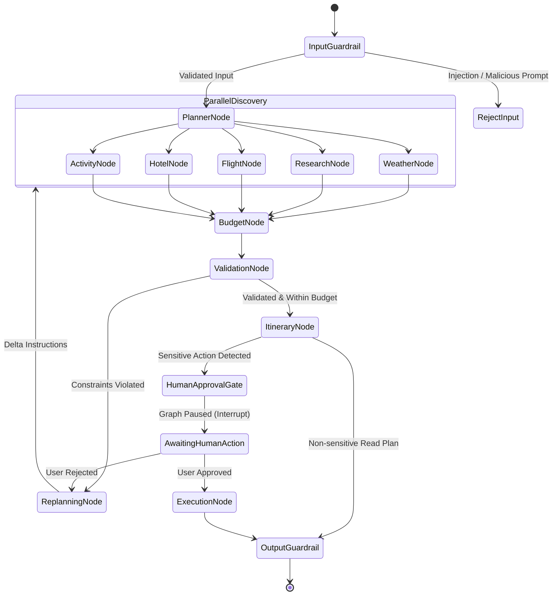
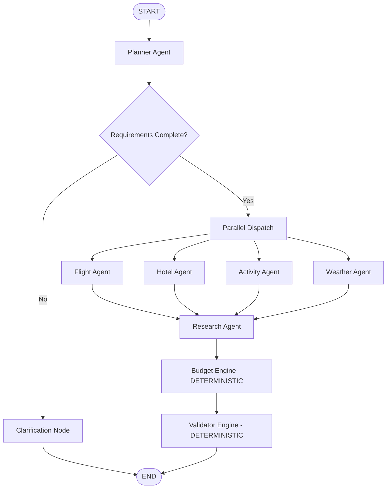
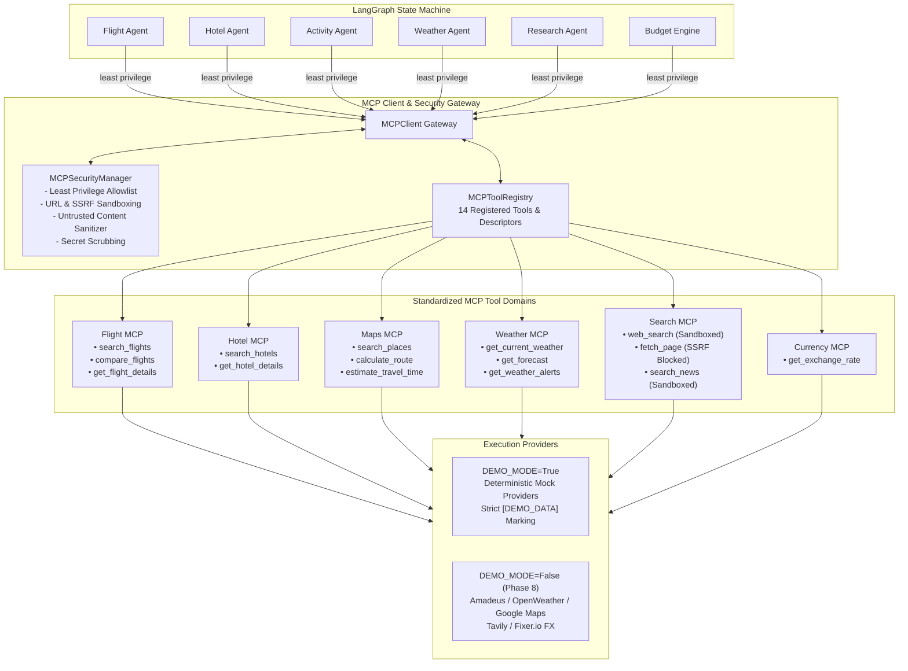
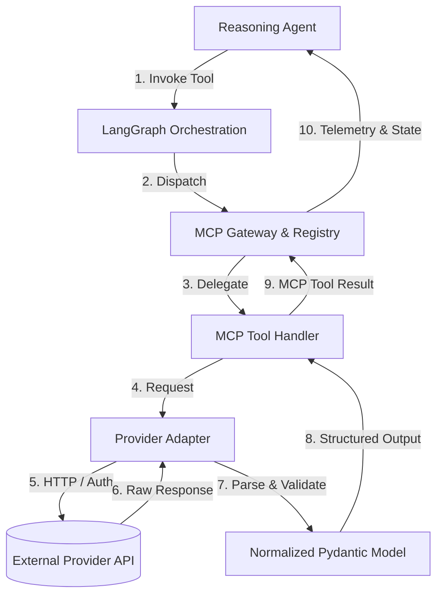
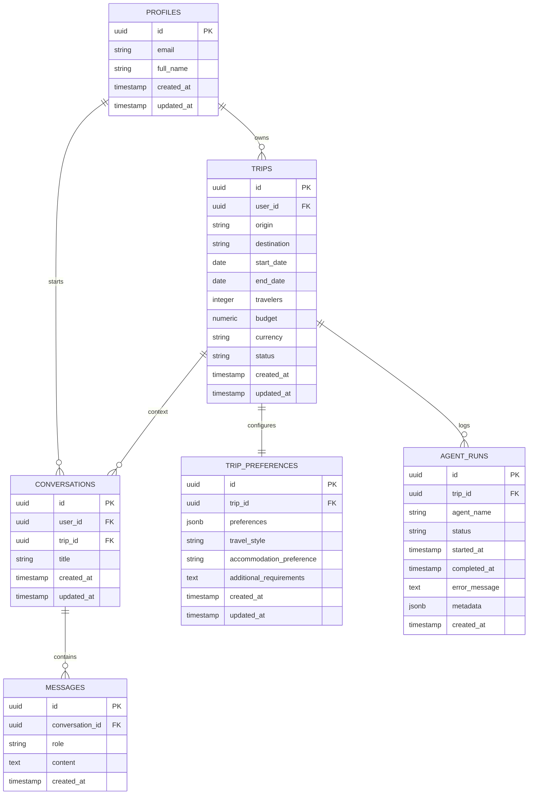
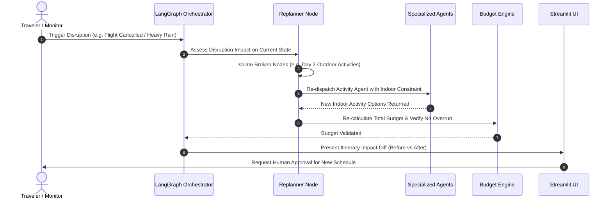

# System Architecture: Multi-Agent AI Travel Intelligence & Dynamic Replanning Platform

## 1. Overall System Architecture

The platform follows a layered, decoupled architecture designed for high availability, verifiable correctness, and modular scalability.


---

## 2. Streamlit Architecture

The user interface is structured around a reactive, multi-view paradigm that separates presentation logic from agent orchestration:

1. **State Isolation (`st.session_state`)**:
   - `session_id` & `user_id`: Authenticated user session tokens.
   - `current_trip`: Current active trip entity loaded from Supabase.
   - `graph_state`: Snapshot of the active LangGraph execution state.
   - `interrupt_payload`: Holds pending human-approval tokens and approval request payloads.
   - `chat_history`: Conversation timeline of user intents and agent responses.
2. **View Decomposition**:
   - **Trip Conception View**: Conversational natural language input, date pickers, budget sliders, and travel preference chips.
   - **Agent Execution Monitor**: Live visualization of active agents, step-by-step reasoning logs, tool calls, and latency indicators.
   - **Interactive Itinerary View**: Day-by-day interactive timeline with flight cards, hotel details, weather forecasts, and route maps.
   - **Dynamic Disruption & Replanning Sandbox**: Interactive controls allowing users to inject disruptions (e.g. simulated 5-hour flight delay, thunderstorm alert, or hotel cancellation) and observe live delta-replanning.
   - **Human Approval Modal / Card**: Explicit approval checkpoint with action summary, total financial charge, and cancellation terms.
3. **Async-to-Sync Bridge**:
   - LangGraph runs asynchronously; Streamlit operates synchronously per script run.
   - Background execution is bridged via an async runner with streaming queue consumption, updating UI components dynamically as graph nodes complete.

---

## 3. LangGraph Architecture

LangGraph orchestrates the multi-agent system as a **Stateful Directed Acyclic/Cyclic Graph** with explicit checkpoints.



### 3.1 Multi-Agent & Deterministic Workflow Engine (Phases 5 & 6)

The LangGraph state machine orchestrates concurrent specialized domain agents followed by deterministic calculation and validation engines:



#### Core Components & Architectural Principles
1. **Shared State Architecture (`TravelState`)**:
   - Specialized agents **never directly invoke one another**. All state transfer, findings, and metadata are mediated exclusively through the centralized `TravelState`.
   - Distinct domain keys (`flight_options`, `hotel_options`, `activities`, `weather`, `research_results`, `budget_breakdown`, `validation_results`) ensure zero concurrent write collisions during parallel fan-out.
   - Shared diagnostic arrays (`agent_runs`, `warnings`, `errors`) utilize `Annotated[List[...], operator.add]` reducers for thread-safe state accumulation.
2. **Parallel Fan-Out & Convergence**:
   - Once requirements are validated, LangGraph triggers `Flight`, `Hotel`, `Activity`, and `Weather` in parallel.
   - All 4 branches converge into the `Research` node, which compiles destination cultural intelligence.
   - The workflow then pipes sequentially into `BudgetEngine` and `ValidatorEngine`.
3. **Deterministic Financial Calculation (Zero LLM Arithmetic)**:
   - **Why LLMs are NOT used for math**: Probabilistic language models hallucinate arithmetic sums, round unpredictably, and fail financial precision constraints.
   - All cost calculations (`flights + hotels + activities + food + transport + misc`) are executed in pure Python floating-point math in `BudgetEngine`.
   - Supports **STRICT budget strategy**: if `total_estimated_cost > budget`, marks `within_budget = False`, computes exact currency variance, and flags `OVER_BUDGET`.
4. **Deterministic Feasibility & Time-Conflict Validation**:
   - **Why LLMs are NOT used for validation**: LLM-based constraint checking is nondeterministic, prone to sycophancy, and susceptible to prompt injection.
   - `ValidatorEngine` applies deterministic Python rules:
     - *Dates*: Enforces positive durations, valid ISO strings, and date ordering (`end_date >= start_date`). Supports flexible unpinned dates with non-fatal warnings.
     - *Travelers*: Enforces positive integer headcounts (`travelers >= 1`).
     - *Flights*: Rejects flights where departure is at or after arrival (`departure < arrival`).
     - *Hotels*: Validates non-negative nightly rates and stay durations.
     - *Activities*: Identifies duplicate activities and flags travel-time conflicts (`POSSIBLE_TIME_CONFLICT`) when flight arrivals buffer insufficiently with activity starts.
     - *Weather*: Audits presence of meteorological feeds; flags `WEATHER_UNAVAILABLE` on agent failure without fabricating forecasts.
5. **Validation Severity Hierarchy & Workflow Transitions**:
   - `INFO`: Informational state notice (e.g. `DEMO_DATA_ACTIVE`).
   - `WARNING`: Non-fatal advisory (e.g. `OVER_BUDGET`, `WEATHER_UNAVAILABLE`, `POSSIBLE_TIME_CONFLICT`, `CURRENCY_MISMATCH`). Workflow transitions to `READY_WITH_WARNINGS`.
   - `ERROR`: Critical blocking invalidity (e.g. `INVALID_DATE_ORDER`, `INVALID_TRAVELER_COUNT`, `NEGATIVE_BUDGET`). Workflow transitions to `VALIDATION_FAILED`.
   - When 0 errors and 0 warnings exist: transitions to `READY_FOR_ITINERARY`.
6. **Failure Isolation & `DEMO_DATA` Boundaries**:
   - All executions are wrapped with `execute_agent_safely` in `agents/base_agent.py`. Individual agent failures do not crash the pipeline.
   - All mock deliverables explicitly carry `demo_data: True` and clear source attributions (`[DEMO_DATA]`). Live tool integrations (MCP) arrive in Phase 7.

### 3.2 Graph Structural Design
- **Deterministic Routing**: Conditional edges check typed flags in the graph state rather than relying on LLM routing decisions for state transitions.
- **Cycle Prevention**: Loop protection limits (`MAX_GRAPH_STEPS = 10`) guarantee termination; retries on LLM parsing failures are strictly bounded to `MAX_PLANNER_RETRIES = 2`.
- **State Checkpointing**: Every node transition creates a persistent snapshot in the Supabase/Memory checkpointer, enabling seamless crash recovery and human approval suspension.

---

## 4. Agent Responsibilities & Division of Labor

The system enforces a strict boundary between **Agent Reasoning** and **Deterministic Calculation**:

| Component | Nature | Technologies | Role & Boundaries |
|-----------|--------|--------------|-------------------|
| **Planner Agent** | Probabilistic (LLM) | GPT-4o / Claude 3.5 Sonnet | Deconstructs user prompt into a structured `TripRequirementSpec`; identifies constraints, preferences, and tradeoffs. |
| **Flight Agent** | Probabilistic + Tool | LLM + Flight Tools | Identifies viable flight corridors, compares transit durations, filters baggage options, selects best candidate flights. |
| **Hotel Agent** | Probabilistic + Tool | LLM + Hotel Tools | Evaluates lodging alternatives considering proximity to attractions, ratings, and price bands. |
| **Activity Agent** | Probabilistic + Tool | LLM + Places/RAG Tools | Curates cultural, leisure, and dining experiences respecting user pacing and travel style. |
| **Weather Agent** | Hybrid | LLM + Weather Tool | Fetches forecast and seasonal patterns; flags outdoor risk factors for the Planner. |
| **Research Agent** | Hybrid | LLM + RAG + Web Search | Queries destination guidelines (visas, local customs, transit passes, seasonal alerts). |
| **Budget Engine** | **Deterministic (Python)** | **Pure Python** | **Calculates exact totals, taxes, currency conversions, contingency buffers. Zero LLM math.** |
| **Validator Engine** | **Deterministic (Python)** | **Pure Python** | **Verifies timing feasibility, minimum connection times, open hours, pace fatigue indices.** |
| **Replanner Agent** | Probabilistic (LLM) | GPT-4o / Fast LLM | Formulates delta correction instructions when budget or validation engines flag an issue. |
| **Itinerary Agent** | Probabilistic (LLM) | GPT-4o | Synthesizes all approved components into a cohesive, narrative day-by-day itinerary. |

---

## 5. LangGraph State Schema

The graph operates on an immutable, strongly-typed state model governed by Pydantic v2:

```python
from typing import TypedDict, List, Dict, Optional, Any
from pydantic import BaseModel, Field

class TripState(TypedDict):
    # Workflow Metadata
    session_id: str
    user_id: str
    trip_id: str
    replan_count: int
    current_status: str
    
    # User Inputs & Extracted Spec
    user_prompt: str
    trip_spec: Dict[str, Any]             # Serialized TripRequirementSpec
    
    # Agent Candidate Outputs
    weather_data: Optional[Dict[str, Any]]
    research_insights: List[Dict[str, Any]]
    flight_options: List[Dict[str, Any]]
    selected_flights: Optional[Dict[str, Any]]
    hotel_options: List[Dict[str, Any]]
    selected_hotel: Optional[Dict[str, Any]]
    activity_options: List[Dict[str, Any]]
    selected_activities: List[Dict[str, Any]]
    
    # Deterministic Evaluation Results
    budget_breakdown: Optional[Dict[str, Any]]   # Total, transport, lodging, activities, contingency
    budget_approved: bool
    budget_overrun_amount: float
    
    validation_passed: bool
    validation_issues: List[Dict[str, Any]]      # Detailed feasibility or safety warnings
    
    # Replanning & Disruption Context
    disruption_event: Optional[Dict[str, Any]]
    replanning_instructions: Optional[str]
    
    # Human-in-the-Loop Approval State
    requires_human_approval: bool
    approval_type: Optional[str]                 # "booking", "cancellation", "budget_override"
    approval_payload: Optional[Dict[str, Any]]
    is_approved: Optional[bool]
    
    # Final Output
    final_itinerary: Optional[Dict[str, Any]]
    error_message: Optional[str]
```

---

## 6. Model Context Protocol (MCP) Architecture (Phase 7 Implemented)

The platform adopts the **Model Context Protocol (MCP)** to standardize agent-to-tool integration, decoupling probabilistic reasoning agents from external APIs and infrastructure capabilities.



### 6.1 Architectural Role Separation

The platform establishes distinct, non-overlapping architectural roles:

- **Agent = Reasoning & Decision Making**: Probabilistic intelligence evaluating constraints, assessing trade-offs, and coordinating domain objectives.
- **MCP = Standardized Capability & Tool Access**: Strongly-typed protocol layer abstracting third-party capabilities, input schemas, and execution boundaries.
- **Python = Deterministic Business Logic**: Pure Python arithmetic, temporal feasibility checks, and budget auditing with zero LLM math or hallucination risk.
- **LangGraph = Stateful Orchestration**: Graph state machine coordinating parallel fan-out, fan-in convergence, retries, and checkpointing.
- **Supabase = Persistent Storage & Security**: PostgreSQL persistence, Row Level Security (RLS), and JWT authentication.
- **RAG = Curated Knowledge Retrieval**: Vector similarity search over static travel guides, cultural norms, and destination documentation.
- **Web Search = Fresh Dynamic Information**: Sandboxed external search querying real-time conditions, events, and seasonal updates.

### 6.2 MCP vs Direct API Integration vs Normal Function Calling

| Evaluation Dimension | Direct API Integration | Normal Function Calling | Model Context Protocol (MCP) |
|----------------------|------------------------|-------------------------|------------------------------|
| **Coupling** | High: Agents depend directly on provider SDKs (e.g. Amadeus client). | Medium: Agents depend on local in-repo helper functions. | **Zero**: Agents interact via standard tool protocol interfaces. |
| **Provider Swapping** | Hard: Refactoring agent logic when migrating from Mock to Amadeus or Sabre. | Medium: Requires rewriting internal helper functions. | **Trivial**: Change tool descriptor backend without altering agent logic. |
| **Security Boundaries** | Poor: API tokens exposed in agent execution memory. | Inconsistent: Ad-hoc validation across helper scripts. | **Strict**: Centralized least-privilege allowlists, URL sandboxing, SSRF blocking. |
| **Observability** | Ad-hoc custom logging per provider. | Inconsistent function return structures. | **Uniform**: Standardized execution ID, latency, retry count, and masked telemetry. |
| **Multi-Language / Remote** | Tied to Python runtime. | In-process Python only. | Extensible across language boundaries and remote microservices. |

### 6.3 Tool Permission Model & Least Privilege Matrix

No agent has automatic or universal access to all tools. Invoking an unauthorized tool immediately triggers a `PERMISSION_DENIED` execution error without invoking provider logic:

```python
AGENT_TOOL_PERMISSIONS = {
    "flight": {"search_flights", "compare_flights", "get_flight_details"},
    "hotel": {"search_hotels", "get_hotel_details"},
    "activity": {"search_places", "calculate_route", "estimate_travel_time"},
    "weather": {"get_current_weather", "get_forecast", "get_weather_alerts"},
    "research": {"web_search", "fetch_page", "search_news"},
    "budget": {"get_exchange_rate"},
    "validator": {"estimate_travel_time", "get_exchange_rate"},
}
```

*Explicitly prohibited operations*: Booking, payments, booking cancellations, shell execution, arbitrary code execution, and arbitrary URL downloads are strictly prohibited across all agents.

### 6.4 Security Boundaries & Sandboxing

1. **Input & Argument Validation**: Every tool enforces Pydantic v2 schemas. Missing or malformed parameters are rejected with structured `INVALID_ARGUMENTS` errors.
2. **SSRF & Private IP Blocking**: `FetchPageInput` rejects any non-HTTP(S) protocol and blocks private subnets (`127.0.0.1`, `localhost`, `0.0.0.0`, `10.x.x.x`, `192.168.x.x`, `169.254.x.x`).
3. **Untrusted Web Content Sanitization**: All content retrieved via Search MCP tools is tagged `untrusted: True`. Text is stripped of script tags, style blocks, and sanitized against prompt injection patterns (`ignore previous instructions`, `system prompt`, `developer mode`).
4. **Secret Scrubbing in Telemetry**: Telemetry payloads automatically mask sensitive credentials (`api_key`, `secret`, `token`, `password`, `authorization`) with `[MASKED_SECRET]`.

### 6.5 Failure Isolation & Resiliency

MCP tool failures do not crash the LangGraph workflow:
- Errors return structured `ToolExecutionError` with `tool_name`, `error_code`, `message`, `retryable`, and `execution_id`.
- The invoking agent isolates the tool failure, records diagnostic warnings in state, falls back to deterministic models if available, and allows the remaining parallel agents to proceed unimpeded.

---

## 7. Real API / Provider Adapter Architecture (Phase 8 Implemented)

### 7.1 Provider Integration Architecture & Information Flow

The platform enforces a strict architectural boundary: **Agents never directly call external APIs**. All external network communications occur through dedicated provider adapters encapsulated behind MCP tools:



### 7.2 Integrated Provider Ecosystem

| Capability Domain | Real Provider Adapter | Protocol / Endpoint | Auth & Credentials | DEMO Mode Fallback |
|---|---|---|---|---|
| **Foreign Exchange** | `CurrencyProvider` (Frankfurter) | REST: `api.frankfurter.dev/v1/latest` | Open / Keyless (European Central Bank) | Deterministic `USD_BASE_RATES` table |
| **Climatology & Forecasts** | `WeatherProvider` (Open-Meteo) | REST: `api.open-meteo.com/v1/forecast` | Open / Keyless (WMO 7-14 day forecast) | Deterministic seasonal weather cycle |
| **Places & POI Discovery** | `MapsProvider` (Photon / OSM) | REST: `photon.komoot.io/api` | Open / Keyless (OpenStreetMap POIs) | Curated architectural landmarks catalog |
| **Corridor Routing & Transit** | `MapsProvider` (OSRM) | REST: `router.project-osrm.org/route/v1` | Open / Keyless (OSRM driving/transit) | Speed-factor transit matrix |
| **Live Knowledge & Search** | `SearchProvider` (Wikipedia & Tavily) | REST: `en.wikipedia.org/w/api.php` | Keyless Wikipedia; `TAVILY_API_KEY` (opt) | Sandboxed travel guidance snippets |
| **Aviation Corridors** | `FlightProvider` (Amadeus GDS) | REST: `test.api.amadeus.com/v2/shopping` | OAuth2: `AMADEUS_CLIENT_ID` + Secret | Deterministic global GDS catalog |
| **Hospitality Search** | `HotelProvider` (Amadeus Hospitality) | REST: `test.api.amadeus.com/v1/reference-data` | OAuth2: `AMADEUS_CLIENT_ID` + Secret | Curated hotel aggregator index |

### 7.3 Timeouts, Retries, and Error Classification

Every external provider request is executed via `BaseProvider.execute_http_request()`:
- **Explicit Timeout Ceilings**: 5.0s to 8.0s hard timeout per HTTP call (preventing hanging agent threads).
- **Bounded Exponential Backoff**: Maximum 2 retries (`attempt = 0, 1, 2`) with jittered backoff delay (`0.3s * 2^attempt`).
- **Error Classification**:
  - *Retryable Errors*: `ProviderTimeoutError`, `ProviderNetworkError` (transport/DNS failure, HTTP 5xx), `ProviderRateLimitError` (HTTP 429).
  - *Non-Retryable Errors*: `ProviderConfigurationError` (missing credentials in LIVE mode), `ProviderAuthenticationError` (HTTP 401/403), `ProviderResponseValidationError` (malformed schema), client errors (400-499).
- **Rate Limit Backoff**: Automatically reads `Retry-After` header on HTTP 429 responses, pauses execution up to a safety ceiling (3.0s), and logs throttled provider events without infinite loops.

### 7.4 In-Memory TTL Caching Policy

To prevent redundant API consumption and mitigate third-party rate limits, `ProviderCache` provides thread-safe in-memory caching:
- **Currency Rates**: TTL = 3,600 seconds (1 hour). Exchange rates change slowly during planning sessions.
- **Weather Forecasts**: TTL = 600 seconds (10 minutes).
- **Spatial Places & Routes**: TTL = 3,600 seconds (1 hour).
- **Web Search Queries**: TTL = 900 seconds (15 minutes).
- **Flight & Hotel Queries**: TTL = 1,800 seconds (30 minutes).
- *Strict Rule*: Real-time seat availability locks are never cached; caching only applies to initial discovery queries.

### 7.5 Untrusted Data Isolation & Security

1. **Third-Party Data Sanitization**: All external web data is treated as **UNTRUSTED DATA**:
   - Stripped of `<script>`, `<style>`, and raw HTML tags.
   - Neutralized against prompt injection patterns (`ignore previous instructions`, `developer mode`, `system prompt`).
   - Length-capped at 3,000 characters before delivery to reasoning models.
2. **SSRF & Address Filtering**: `fetch_page` forbids loopbacks (`127.0.0.1`, `localhost`), link-local metadata services (`169.254.169.254`), and private subnets (`10.0.0.0/8`, `192.168.0.0/16`, `172.16.0.0/12`).
3. **Zero Secret Leakage**:
   - Credentials originate exclusively from environment variables.
   - Outbound HTTP headers automatically redact `Authorization`, `X-Api-Key`, tokens, and passwords (`[REDACTED_SECRET]`).
   - Audit telemetry logs sanitize all parameter maps with `[MASKED_SECRET]`.

### 7.6 Source Attribution & Telemetry

All provider responses record provenance metadata for end-user auditability:
```json
{
  "provider": "Amadeus GDS",
  "source_url": "https://test.api.amadeus.com/v2/shopping/flight-offers",
  "retrieved_at": "2026-09-28T23:30:00Z",
  "data_mode": "LIVE"
}
```

### 7.7 Scope Limitation (Read-Only Intelligence)

Phase 8 is strictly **read-only travel intelligence**. The platform intentionally does NOT implement:
- Flight booking or ticketing
- Hotel reservations or payment processing
- Ticket cancellations or user financial transactions
- Autonomous credit card authorizations

---

## 8. RAG (Retrieval-Augmented Generation) & pgvector Architecture

The platform incorporates an enterprise-grade Retrieval-Augmented Generation (RAG) architecture using **Supabase PostgreSQL with the pgvector extension**, HNSW indexing, and hybrid metadata filtering.

### 8.1 Conceptual Retrieval Flow

```text
                USER QUERY
                     ↓
                  AGENT
                     ↓
              RAG RETRIEVER
                     ↓
             Supabase pgvector
                     ↓
          Semantic + Metadata Filter
                     ↓
             Relevant Chunks
                     ↓
                   AGENT
```

### 8.2 Architectural Roles: RAG vs MCP/API vs Web Search

The system strictly delineates information sources by stability, structure, and operational volatility:

| Layer | Primary Role | Examples | Authority / Lifespan | Technology |
| :--- | :--- | :--- | :--- | :--- |
| **RAG Knowledge Base** | **Stable / Curated Knowledge** | Local customs, temple bowing rules, tipping taboos, attraction history, subway norms | Semi-permanent; vetted editorial knowledge | Supabase pgvector + HNSW |
| **MCP / API Gateway** | **Structured Live Data** | Flight schedules, seat availability, hotel nightly rates, real-time weather forecasts, FX rates | Volatile operational; real-time transactional | Amadeus GDS, Open-Meteo, Frankfurter |
| **Web Search** | **Fresh / Current Information** | Transport strikes, sudden airport terminal closures, local festival dates, emergency alerts | Highly dynamic; minutes to days | Tavily / Brave Search API |

### 8.3 pgvector Storage & Migration Specification

All curated and user-private knowledge chunks are persisted in the dedicated `public.travel_documents` table (`20260928000003_pgvector_rag.sql`):

- **Fields**:
  - `id UUID PRIMARY KEY DEFAULT gen_random_uuid()`
  - `document_id TEXT NOT NULL`: Unique parent document identifier.
  - `chunk_id TEXT NOT NULL UNIQUE`: Deterministic chunk identifier (`{doc_id}_c{idx}_{hash}`).
  - `title TEXT NOT NULL`: Document or section heading.
  - `content TEXT NOT NULL`: Cleaned textual chunk body.
  - `embedding vector(1536)`: 1536-dimensional vector matching OpenAI `text-embedding-3-small`.
  - `source TEXT NOT NULL`: Publishing organization or archive name.
  - `source_url TEXT`: Canonical web address if available (never fabricated).
  - `source_trust TEXT NOT NULL DEFAULT 'CURATED'`: Classification (`OFFICIAL`, `CURATED`, `REFERENCE`, `UNKNOWN`).
  - `destination TEXT`: Target city/destination filter.
  - `country TEXT`: Target country filter.
  - `category TEXT NOT NULL`: Topic classification (`customs`, `attractions`, `transport`, `food`, `tips`, `general`).
  - `metadata JSONB NOT NULL DEFAULT '{}'`: Extensible metadata payload.
  - `is_public BOOLEAN NOT NULL DEFAULT true`: Visibility scope.
  - `user_id UUID REFERENCES auth.users(id)`: Owning user UUID for private documents.
  - `content_hash TEXT NOT NULL`: SHA-256 digest of cleaned text for deduplication.
  - `created_at`, `updated_at`: Audit timestamps.
- **Indexes**:
  - HNSW Index: `CREATE INDEX idx_travel_documents_embedding_hnsw ON public.travel_documents USING hnsw (embedding vector_cosine_ops);`
  - B-tree Relational Indexes: `(destination)`, `(country)`, `(category)`, `(user_id)`, `(document_id)`, `(content_hash)`.
- **Stored Procedure (`match_travel_documents`)**:
  Performs server-side cosine distance ordering (`1 - (embedding <=> query_embedding)`) combined with relational predicate evaluation on destination, country, category, and user ownership under `SECURITY INVOKER`.

### 8.4 Ingestion Pipeline & Deterministic Chunking

1. **Format Support**: Markdown (`.md`), Plain Text (`.txt`), and JSON (`.json`).
2. **Text Cleaning**: Strips null bytes, unprintable control characters, normalizes carriage returns, and collapses excessive blank lines.
3. **Deterministic Chunking**:
   - Primary boundary: Paragraphs (`\n\n`).
   - Secondary boundary: Sentences (`[.!?]\s+`) when paragraphs exceed `rag_chunk_size` (default: 500 characters).
   - Overlap: Bounded character window (`rag_chunk_overlap=80`).
   - Pruning: Filters out trivially short fragments (< 25 characters).
4. **Deduplication & Cost Optimization**:
   - Ingestion computes SHA-256 hash of entire cleaned text.
   - If an identical document hash exists in the ingestion cache, existing chunks are reused without invoking external embedding APIs.

### 8.5 Security, RLS & Private Document Isolation

- **Row Level Security**:
  - `is_public = true` allows public read access for curated baseline destination guides.
  - `auth.uid() = user_id` enforces strict tenant isolation for user-uploaded private travel documents.
  - A user cannot retrieve or inspect another user's private travel documents under any query condition.
- **Prompt Injection Defense**:
  - All retrieved chunks are explicitly tagged with `untrusted: True`.
  - Injected context is sanitized against adversarial directive keywords (`Ignore previous instructions`, `SYSTEM:`, `<script>`).
  - Context is isolated in `<curated_travel_knowledge>` XML blocks instructing reasoning models to treat the content solely as factual reference data.

### 8.6 DEMO_MODE Offline Operation

In development, unit testing, or interview demonstrations (`DEMO_MODE=true` or missing `OPENAI_API_KEY`):
- `MockEmbeddingService`: Generates deterministic, unit-normalized 1536-dimensional float vectors from text SHA-256 hashes and token buckets.
- `MockKnowledgeStore`: Maintains an in-memory vector store pre-seeded with rich curated guides for Tokyo, Paris, London, New York, Delhi, and Rome.
- Computes exact mathematical cosine similarity offline with zero API latency and zero cost.

---

## 8. Web Search Architecture

While RAG handles static travel knowledge, **Web Search** handles **fresh, volatile real-time conditions**:
- Sudden airport terminal closures or airline strikes
- Live festival and event dates
- Seasonal weather anomalies or unexpected attraction renovations
- Current currency exchange fluctuations

### Integration Pattern:
- **Search Query Synthesizer**: The Research Agent formulates targeted, temporal search queries (e.g. `"Louvre museum renovation closures October 2026"`).
- **Provider Gateway**: Uses search providers (Tavily / Brave Search API) optimized for LLM context retrieval.
- **Content Deduplication & Truncation**: Retrieved markdown/snippets are scrubbed of HTML tags, deduplicated, and truncated to avoid token waste before entering the context window.

---

## 9. Supabase Architecture (PostgreSQL, Auth & pgvector)

Supabase serves as the unified persistence, authentication, and security foundation:



### 9.1 Database Schema Design
1. **`profiles`**: Linked 1-to-1 with `auth.users(id)` via an automated PostgreSQL trigger (`on_auth_user_created`). Ensures user records exist within public schema.
2. **`trips`**: Normalized table containing core route, scheduling, budget limits, and status (`DRAFT`, `PLANNING`, `APPROVED`, `COMPLETED`, `CANCELLED`).
3. **`trip_preferences`**: Decoupled preference table for qualitative traveler parameters, travel style, lodging preferences, and additional notes.
4. **`conversations`**: Thread parent entities linked to `user_id` and optionally to `trip_id`.
5. **`messages`**: Chronological conversation history with roles strictly validated to `user`, `assistant`, or `system`.
6. **`agent_runs`**: Immutable audit log tracking start, completion, error messages, and telemetry for every agent node in the workflow.

### 9.2 Row Level Security (RLS) Strategy
- **Engine-Level Isolation**: RLS is activated on all 6 tables (`ALTER TABLE ... ENABLE ROW LEVEL SECURITY;`).
- **Direct Ownership**: Tables with direct user ownership (`profiles`, `trips`, `conversations`) use `USING (auth.uid() = user_id)`.
- **Hierarchical Ownership**: Child tables (`trip_preferences`, `messages`, `agent_runs`) use correlated subqueries (`EXISTS (SELECT 1 FROM trips WHERE trips.id = trip_id AND trips.user_id = auth.uid())`), eliminating the risk of data leakage.

### 9.3 Repository Layer & DEMO_MODE Fallback
- Services and UI components never execute raw SQL or PostgREST queries directly.
- The repository layer (`TripRepository`, `ConversationRepository`, `MessageRepository`, `AgentRunRepository`) inspects `is_demo_mode`:
  - In `DEMO_MODE=true` or when credentials are missing, repositories route to an in-memory `MockDataStore` tagging records as `is_demo: True`.
  - In live mode, operations execute against Supabase with JWT authorization.
- Zero code changes required to toggle between local offline demos and production.

---

## 10. Guardrails & Security Architecture

1. **Input Guardrails**:
   - Inspects raw prompts for known jailbreaks, role-reversal attacks, and prompt injection signatures.
   - Rejects or sanitizes prompts attempting to alter core instructions or extract system prompts.
2. **Tool Execution Guardrails**:
   - Whitelisted tool names per agent.
   - Deterministic argument validation using Pydantic schemas before tool dispatch.
   - Least-privilege: Read-only for discovery agents; write/booking tools strictly gatekeeped.
3. **Output Guardrails**:
   - Every agent output passes through `pydantic.BaseModel.model_validate_json()`.
   - Prevents malformed JSON or markdown codeblocks from corrupting the graph state.
   - PII filter scrubs phone numbers, credit card numbers, or passport numbers from persistent logs.

---

## 11. Dynamic Replanning Architecture

Dynamic replanning is an essential differentiator for this platform:



### Key Principles:
- **Surgical Delta Replanning**: Avoids regenerating unaffected days or confirmed flight bookings. Only invalidated segments are replanned.
- **Budget Preservation**: Any alternative activity or hotel must not exceed the remaining allocated category budget.
- **Versioned History**: Past itinerary versions are archived in `replanning_history` with the exact disruption cause and agent rationale.

---

## 12. Human-in-the-Loop (HITL) Architecture

LangGraph provides native support for pausing graph execution via **Interrupts**:
1. When the graph reaches a state requiring authorization (e.g. executing flight reservation, hotel booking, or paying an extra fee during replanning), the `ApprovalGate` node raises an `interrupt()`.
2. The graph state is automatically checkpointed to the persistent database.
3. The Streamlit UI detects the suspended state, displays the exact financial liability and itemized details, and renders **Approve** and **Reject/Modify** actions.
4. When the user clicks **Approve**, the UI calls `graph.invoke(Command(resume={"action": "approve"}))`.
5. The execution resumes from the exact checkpoint, completing the transaction and updating the itinerary status.

---

## 13. LangSmith Observability & Evaluation

Every user interaction and agent step is monitored:
- **Distributed Run Trees**: Hierarchical spans illustrate the exact flow from User Prompt -> Planner -> Parallel Sub-agents -> Budget Validation -> Synthesis.
- **Token & Cost Attribution**: Real-time token consumption breakdown per agent node, distinguishing between fast models (GPT-4o-mini) and reasoning models (GPT-4o).
- **Latency Profiling**: Identifies bottlenecks across external APIs, vector queries, and LLM completions.
- **Automated Regression Evaluation**: LangSmith dataset evaluators measure itinerary quality, constraint adherence, and hallucination rates across test suites.

---

## 14. Failure Handling & Resilience

1. **API Timeouts & Retries**: All outbound HTTP and MCP requests have a hard 25-second timeout, with exponential backoff retries (maximum 2 retries).
2. **Graceful Fallback to DEMO_MODE**: If an external provider (e.g., Amadeus or OpenWeather) returns 5xx or rate limit errors, the system seamlessly falls back to cached/mock data and notifies the user with a warning banner.
3. **Graph Circuit Breakers**: `MAX_GRAPH_STEPS = 30` prevents infinite recursion in replanning loops.
4. **Data Redundancy**: Itineraries are persisted at each stage, ensuring a transient browser refresh never loses trip progress.
