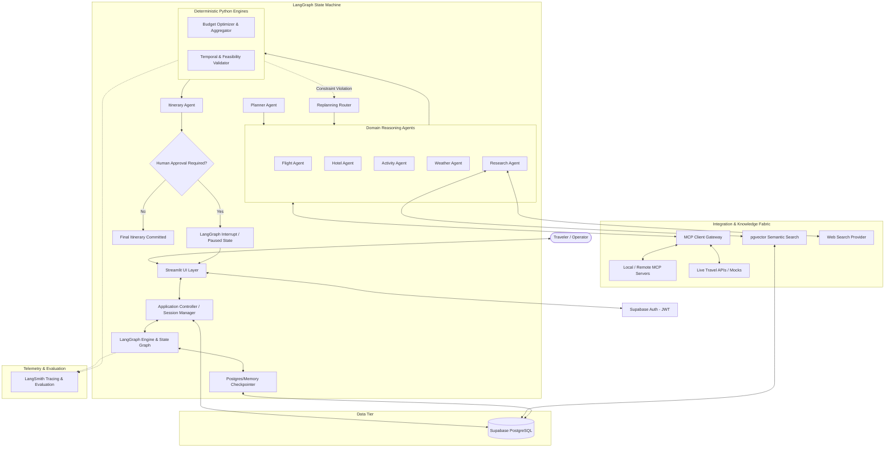
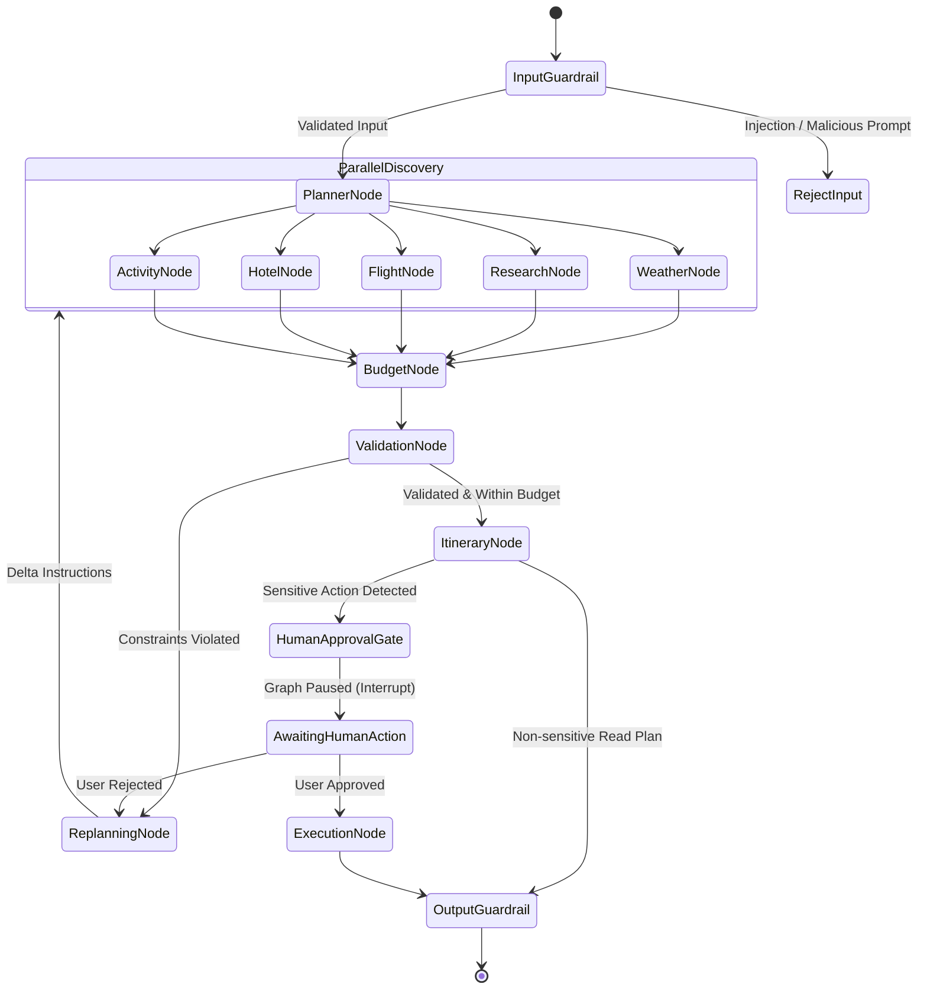
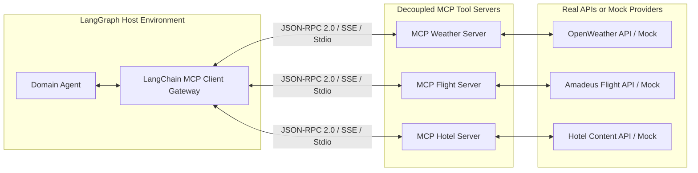
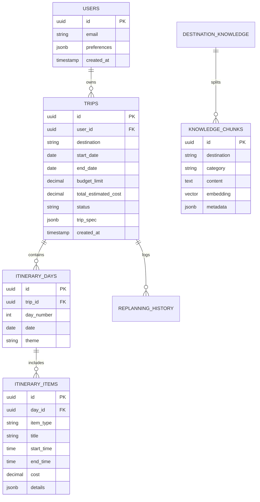
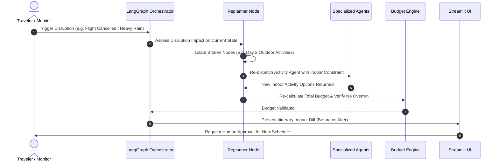

# System Architecture: Multi-Agent AI Travel Intelligence & Dynamic Replanning Platform

## 1. Overall System Architecture

The platform follows a layered, decoupled architecture designed for high availability, verifiable correctness, and modular scalability.



---

## 2. Streamlit Architecture

The user interface is structured around a reactive, multi-view paradigm that separates presentation logic from agent orchestration:

1. **State Isolation (`st.session_state`)**:
   - `session_id` & `user_id`: Authenticated user session tokens.
   - `current_trip`: Current active trip entity loaded from Supabase.
   - `graph_state`: Snapshot of the active LangGraph execution state.
   - `interrupt_payload`: Holds pending human-approval tokens and approval request payloads.
   - `chat_history`: Conversation timeline of user intents and agent responses.
2. **View Decomposition**:
   - **Trip Conception View**: Conversational natural language input, date pickers, budget sliders, and travel preference chips.
   - **Agent Execution Monitor**: Live visualization of active agents, step-by-step reasoning logs, tool calls, and latency indicators.
   - **Interactive Itinerary View**: Day-by-day interactive timeline with flight cards, hotel details, weather forecasts, and route maps.
   - **Dynamic Disruption & Replanning Sandbox**: Interactive controls allowing users to inject disruptions (e.g. simulated 5-hour flight delay, thunderstorm alert, or hotel cancellation) and observe live delta-replanning.
   - **Human Approval Modal / Card**: Explicit approval checkpoint with action summary, total financial charge, and cancellation terms.
3. **Async-to-Sync Bridge**:
   - LangGraph runs asynchronously; Streamlit operates synchronously per script run.
   - Background execution is bridged via an async runner with streaming queue consumption, updating UI components dynamically as graph nodes complete.

---

## 3. LangGraph Architecture

LangGraph orchestrates the multi-agent system as a **Stateful Directed Acyclic/Cyclic Graph** with explicit checkpoints.



### 3.1 Graph Structural Design
- **Deterministic Routing**: Conditional edges check typed flags in the graph state rather than relying on LLM routing decisions for state transitions.
- **Cycle Prevention**: A `replan_counter` tracks iterations; if replanning exceeds `MAX_REPLAN_CYCLES` (default 3), the graph transitions to a fallback human-assistance state.
- **State Checkpointing**: Every node transition creates a persistent snapshot in the Supabase/Memory checkpointer, enabling seamless crash recovery and human approval suspension.

---

## 4. Agent Responsibilities & Division of Labor

The system enforces a strict boundary between **Agent Reasoning** and **Deterministic Calculation**:

| Component | Nature | Technologies | Role & Boundaries |
|-----------|--------|--------------|-------------------|
| **Planner Agent** | Probabilistic (LLM) | GPT-4o / Claude 3.5 Sonnet | Deconstructs user prompt into a structured `TripRequirementSpec`; identifies constraints, preferences, and tradeoffs. |
| **Flight Agent** | Probabilistic + Tool | LLM + Flight Tools | Identifies viable flight corridors, compares transit durations, filters baggage options, selects best candidate flights. |
| **Hotel Agent** | Probabilistic + Tool | LLM + Hotel Tools | Evaluates lodging alternatives considering proximity to attractions, ratings, and price bands. |
| **Activity Agent** | Probabilistic + Tool | LLM + Places/RAG Tools | Curates cultural, leisure, and dining experiences respecting user pacing and travel style. |
| **Weather Agent** | Hybrid | LLM + Weather Tool | Fetches forecast and seasonal patterns; flags outdoor risk factors for the Planner. |
| **Research Agent** | Hybrid | LLM + RAG + Web Search | Queries destination guidelines (visas, local customs, transit passes, seasonal alerts). |
| **Budget Engine** | **Deterministic (Python)** | **Pure Python** | **Calculates exact totals, taxes, currency conversions, contingency buffers. Zero LLM math.** |
| **Validator Engine** | **Deterministic (Python)** | **Pure Python** | **Verifies timing feasibility, minimum connection times, open hours, pace fatigue indices.** |
| **Replanner Agent** | Probabilistic (LLM) | GPT-4o / Fast LLM | Formulates delta correction instructions when budget or validation engines flag an issue. |
| **Itinerary Agent** | Probabilistic (LLM) | GPT-4o | Synthesizes all approved components into a cohesive, narrative day-by-day itinerary. |

---

## 5. LangGraph State Schema

The graph operates on an immutable, strongly-typed state model governed by Pydantic v2:

```python
from typing import TypedDict, List, Dict, Optional, Any
from pydantic import BaseModel, Field

class TripState(TypedDict):
    # Workflow Metadata
    session_id: str
    user_id: str
    trip_id: str
    replan_count: int
    current_status: str
    
    # User Inputs & Extracted Spec
    user_prompt: str
    trip_spec: Dict[str, Any]             # Serialized TripRequirementSpec
    
    # Agent Candidate Outputs
    weather_data: Optional[Dict[str, Any]]
    research_insights: List[Dict[str, Any]]
    flight_options: List[Dict[str, Any]]
    selected_flights: Optional[Dict[str, Any]]
    hotel_options: List[Dict[str, Any]]
    selected_hotel: Optional[Dict[str, Any]]
    activity_options: List[Dict[str, Any]]
    selected_activities: List[Dict[str, Any]]
    
    # Deterministic Evaluation Results
    budget_breakdown: Optional[Dict[str, Any]]   # Total, transport, lodging, activities, contingency
    budget_approved: bool
    budget_overrun_amount: float
    
    validation_passed: bool
    validation_issues: List[Dict[str, Any]]      # Detailed feasibility or safety warnings
    
    # Replanning & Disruption Context
    disruption_event: Optional[Dict[str, Any]]
    replanning_instructions: Optional[str]
    
    # Human-in-the-Loop Approval State
    requires_human_approval: bool
    approval_type: Optional[str]                 # "booking", "cancellation", "budget_override"
    approval_payload: Optional[Dict[str, Any]]
    is_approved: Optional[bool]
    
    # Final Output
    final_itinerary: Optional[Dict[str, Any]]
    error_message: Optional[str]
```

---

## 6. Model Context Protocol (MCP) Architecture

The platform adopts the **Model Context Protocol (MCP)** to standardize agent-to-tool integration.



### Why MCP?
- **Tool Decoupling**: Agents do not contain proprietary API client libraries; they communicate via standardized JSON-RPC specifications.
- **Security Sandboxing**: MCP servers can run in isolated processes with restricted network and credential access.
- **Mock Interchangeability**: Switching between `DEMO_MODE=true` and live production only requires swapping MCP endpoints or server configurations, without modifying agent prompt logic.

---

## 7. RAG (Retrieval-Augmented Generation) Architecture

RAG is dedicated to **relatively stable domain knowledge**:
- Destination guides and seasonal climates
- Visa requirements and entry regulations
- Neighborhood safety ratings and public transit tips
- Curated dining and historical activity recommendations

### Pipeline Design:
1. **Document Ingestion**: Markdown/PDF guides chunked with semantic boundaries (chunk size 600 tokens, 100 token overlap).
2. **Embeddings**: Generated using OpenAI `text-embedding-3-small` (1536 dimensions).
3. **Storage & Vector Index**: Supabase PostgreSQL with the `pgvector` extension using an `HNSW` (Hierarchical Navigable Small World) index for fast approximate nearest neighbor search.
4. **Metadata Filtering**: Queries are filtered by `country_code`, `destination_city`, and `category` (e.g., `visa`, `cuisine`, `transit`) prior to vector distance calculation.
5. **Contextual Grounding**: Retrieved context is injected into the Research Agent's system prompt with strict citation constraints.

---

## 8. Web Search Architecture

While RAG handles static travel knowledge, **Web Search** handles **fresh, volatile real-time conditions**:
- Sudden airport terminal closures or airline strikes
- Live festival and event dates
- Seasonal weather anomalies or unexpected attraction renovations
- Current currency exchange fluctuations

### Integration Pattern:
- **Search Query Synthesizer**: The Research Agent formulates targeted, temporal search queries (e.g. `"Louvre museum renovation closures October 2026"`).
- **Provider Gateway**: Uses search providers (Tavily / Brave Search API) optimized for LLM context retrieval.
- **Content Deduplication & Truncation**: Retrieved markdown/snippets are scrubbed of HTML tags, deduplicated, and truncated to avoid token waste before entering the context window.

---

## 9. Supabase Architecture (PostgreSQL, Auth & pgvector)

Supabase serves as the unified persistence and security foundation:



### Security & Row Level Security (RLS)
- Every table containing user data (`trips`, `itinerary_days`, `itinerary_items`, `replanning_history`) enables RLS.
- Policies enforce `auth.uid() = user_id`, guaranteeing absolute data isolation between users.
- Public read access is granted only to the `knowledge_chunks` table for verified vector search operations.

---

## 10. Guardrails & Security Architecture

1. **Input Guardrails**:
   - Inspects raw prompts for known jailbreaks, role-reversal attacks, and prompt injection signatures.
   - Rejects or sanitizes prompts attempting to alter core instructions or extract system prompts.
2. **Tool Execution Guardrails**:
   - Whitelisted tool names per agent.
   - Deterministic argument validation using Pydantic schemas before tool dispatch.
   - Least-privilege: Read-only for discovery agents; write/booking tools strictly gatekeeped.
3. **Output Guardrails**:
   - Every agent output passes through `pydantic.BaseModel.model_validate_json()`.
   - Prevents malformed JSON or markdown codeblocks from corrupting the graph state.
   - PII filter scrubs phone numbers, credit card numbers, or passport numbers from persistent logs.

---

## 11. Dynamic Replanning Architecture

Dynamic replanning is an essential differentiator for this platform:



### Key Principles:
- **Surgical Delta Replanning**: Avoids regenerating unaffected days or confirmed flight bookings. Only invalidated segments are replanned.
- **Budget Preservation**: Any alternative activity or hotel must not exceed the remaining allocated category budget.
- **Versioned History**: Past itinerary versions are archived in `replanning_history` with the exact disruption cause and agent rationale.

---

## 12. Human-in-the-Loop (HITL) Architecture

LangGraph provides native support for pausing graph execution via **Interrupts**:
1. When the graph reaches a state requiring authorization (e.g. executing flight reservation, hotel booking, or paying an extra fee during replanning), the `ApprovalGate` node raises an `interrupt()`.
2. The graph state is automatically checkpointed to the persistent database.
3. The Streamlit UI detects the suspended state, displays the exact financial liability and itemized details, and renders **Approve** and **Reject/Modify** actions.
4. When the user clicks **Approve**, the UI calls `graph.invoke(Command(resume={"action": "approve"}))`.
5. The execution resumes from the exact checkpoint, completing the transaction and updating the itinerary status.

---

## 13. LangSmith Observability & Evaluation

Every user interaction and agent step is monitored:
- **Distributed Run Trees**: Hierarchical spans illustrate the exact flow from User Prompt -> Planner -> Parallel Sub-agents -> Budget Validation -> Synthesis.
- **Token & Cost Attribution**: Real-time token consumption breakdown per agent node, distinguishing between fast models (GPT-4o-mini) and reasoning models (GPT-4o).
- **Latency Profiling**: Identifies bottlenecks across external APIs, vector queries, and LLM completions.
- **Automated Regression Evaluation**: LangSmith dataset evaluators measure itinerary quality, constraint adherence, and hallucination rates across test suites.

---

## 14. Failure Handling & Resilience

1. **API Timeouts & Retries**: All outbound HTTP and MCP requests have a hard 25-second timeout, with exponential backoff retries (maximum 2 retries).
2. **Graceful Fallback to DEMO_MODE**: If an external provider (e.g., Amadeus or OpenWeather) returns 5xx or rate limit errors, the system seamlessly falls back to cached/mock data and notifies the user with a warning banner.
3. **Graph Circuit Breakers**: `MAX_GRAPH_STEPS = 30` prevents infinite recursion in replanning loops.
4. **Data Redundancy**: Itineraries are persisted at each stage, ensuring a transient browser refresh never loses trip progress.
