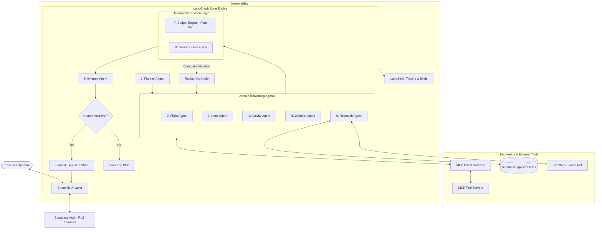

# Multi-Agent AI Travel Intelligence & Dynamic Replanning Platform

[](https://www.python.org/)
[](https://github.com/langchain-ai/langgraph)
[](https://modelcontextprotocol.io/)
[](https://supabase.com/)
[](https://streamlit.io/)
[](https://smith.langchain.com/)

An enterprise-grade, interview-ready multi-agent travel intelligence platform built with **Python, LangGraph, MCP, Supabase, pgvector, and Streamlit**. 

Unlike conventional travel chatbots that produce hallucinated, fragile, or mathematically broken itineraries, this platform treats trip planning as a **stateful, distributed decision-making workflow** powered by specialized AI agents, deterministic Python calculation engines, live disruption recovery, and human-in-the-loop safety gates.

---

## 🌟 Core Highlights

- 🧠 **Multi-Agent Orchestration**: 9 specialized agents coordinated through **LangGraph** with cyclic execution, parallel fan-out, and persistent state.
- 📐 **Strict Separation of Concerns**: **Agents Reason** (qualitative decisions, trade-offs, synthesis) while **Python Calculates** (deterministic financial math, temporal feasibility, and constraint validation). Zero LLM arithmetic errors.
- 🔌 **Standardized Tool Layer (MCP)**: Implements Anthropic's **Model Context Protocol** to cleanly decouple tool execution, sandboxing APIs and allowing instant mock swapping.
- 🔄 **Dynamic Replanning Engine**: Reacts to disruptions (flight delays, storm alerts, attraction closures) with surgical delta-replanning, altering only affected schedule blocks without destroying confirmed plans.
- 🛡️ **Multi-Layer Guardrails**: Input injection detection, tool execution privilege boundaries, and strict output schema validation via **Pydantic v2**.
- 👤 **Human-in-the-Loop (HITL)**: High-stakes operations (booking, payments, cancellations) pause the execution graph using LangGraph interrupts for explicit traveler authorization.
- 📚 **Hybrid Knowledge Fabric**: Curated destination intelligence stored in **Supabase pgvector RAG** combined with live **Web Search** for real-time freshness.
- 📊 **Enterprise Observability**: End-to-end distributed tracing, token attribution, latency profiling, and regression benchmarking with **LangSmith**.
- 🚀 **Offline-First Demo Mode (`DEMO_MODE=true`)**: Run 100% locally with deterministic mock data and tools—no expensive API keys or Docker required for evaluations.

---

## 🏛️ High-Level System Architecture



---

## 🤖 The 9 Specialized Agents

| # | Agent | Primary Role | Core Tools & Technologies |
|---|---|---|---|
| **1** | **Planner Agent** | Parses natural language travel desires into structured `TripRequirementSpec`; plans execution graph. | LLM Reasoning, Pydantic v2 |
| **2** | **Flight Agent** | Searches, filters, and ranks candidate flights matching schedules, transit tolerances, and class. | Flight MCP / Amadeus API / Mock Engine |
| **3** | **Hotel Agent** | Identifies accommodations matching traveler preferences, location radius, amenities, and price ceilings. | Hotel MCP / Booking API / Mock Engine |
| **4** | **Activity / Experience Agent** | Curates cultural, leisure, and dining experiences respecting travel pace and interest themes. | Places API / RAG Knowledge / Mock Engine |
| **5** | **Weather Agent** | Analyzes climate history and forecasts; alerts downstream agents to outdoor hazard windows. | Weather MCP / OpenWeather API / Mock Engine |
| **6** | **Research Agent** | Retrieves visa regulations, transit rules, seasonal advisories, and local customs. | Supabase pgvector RAG + Live Web Search |
| **7** | **Budget Agent** | Enforces hard financial limits; itemizes transport, lodging, activities, food, and contingency. | Pure Python Deterministic Engine |
| **8** | **Validator / Safety Agent** | Validates temporal feasibility, travel buffers, pacing scores, and safety advisories. | Pure Python Constraint Engine |
| **9** | **Itinerary Agent** | Synthesizes approved choices into an interactive, hour-by-hour visual itinerary. | LLM Narrative Synthesis + Structured JSON |

---

## 🛠️ Technology Stack

| Category | Technology | Rationale |
|---|---|---|
| **Language** | Python 3.11+ | Enterprise standard for AI/ML engineering, rich typing, and async runtime. |
| **Frontend UI** | Streamlit | Python-native reactive workspace with dynamic state monitoring and approval modals. |
| **Orchestration** | LangGraph | Stateful cyclic graphs, native human-in-the-loop interrupts, and checkpointing. |
| **Tool Protocol** | Model Context Protocol (MCP) | Industry standard protocol decoupling agent logic from external API implementations. |
| **Database** | Supabase PostgreSQL | Reliable ACID persistence, Row Level Security (RLS), and zero-friction operations. |
| **Vector Search** | Supabase pgvector | Relational data and semantic vector search in one database with HNSW indexing. |
| **Data Validation** | Pydantic v2 | Blazing-fast Rust-based schema validation and structured LLM tool schemas. |
| **Observability** | LangSmith | Distributed run trees, token/cost attribution, latency profiling, and automated evals. |
| **Live Search** | Tavily / Brave Search | Real-time freshness for events, advisories, and sudden travel disruptions. |

---

## 📁 Repository Structure

```
travel-intelligence-platform/
├── .github/                      # GitHub workflows and CI/CD pipelines
├── .env.example                  # Safe configuration template (zero secrets)
├── .gitignore                    # Comprehensive secrets & artifact exclusion rules
├── README.md                     # Project overview & architectural guide
├── PROJECT_SPEC.md               # Complete functional & technical specifications
├── ARCHITECTURE.md               # Detailed architectural deep-dive & schemas
├── ARCHITECTURE_DECISIONS.md     # Architectural Decision Records (ADRs)
├── DEVELOPMENT_PLAN.md           # 18-phase implementation roadmap
├── supabase/                     # Database migrations & RLS policies
│   └── migrations/
├── src/                          # Application source code (Phases 1-17)
│   ├── core/                     # Configuration, logging, telemetry & caching
│   ├── schemas/                  # Pydantic data models & state contracts
│   ├── graph/                    # LangGraph workflow, nodes, and state machine
│   ├── agents/                   # The 9 domain agents & LLM prompts
│   ├── engines/                  # Deterministic Python budget & validator engines
│   ├── services/                 # Supabase, MCP, RAG, Web Search, & Travel APIs
│   ├── guardrails/               # Input, tool, and output security filters
│   ├── mcp_servers/              # Local Model Context Protocol tool servers
│   └── ui/                       # Streamlit multi-view frontend & custom styles
├── tests/                        # Comprehensive test suite & evaluation datasets
└── scripts/                      # Knowledge ingestion & operational runbooks
```

---

## 🚦 Phased Development Status

The platform is developed in **18 distinct phases**:

- [x] **Phase 0: Project Blueprint** *(Completed)*
- [ ] **Phase 1: Project Foundation & Configuration**
- [ ] **Phase 2: Streamlit UI Foundation**
- [ ] **Phase 3: Supabase Integration (PostgreSQL, Auth & RLS)**
- [ ] **Phase 4: LangGraph Core Engine & Planner Agent**
- [ ] **Phase 5: Specialized Mock Domain Agents**
- [ ] **Phase 6: Budget Engine & Validator/Safety Agent (Pure Python)**
- [ ] **Phase 7: Model Context Protocol (MCP) Integration**
- [ ] **Phase 8: Real External APIs Integration**
- [ ] **Phase 9: RAG Knowledge Base & Supabase pgvector**
- [ ] **Phase 10: Live Web Search Integration**
- [ ] **Phase 11: Guardrails & Security Implementation**
- [ ] **Phase 12: Dynamic Replanning Engine**
- [ ] **Phase 13: Human-in-the-Loop (HITL) Gateways**
- [ ] **Phase 14: LangSmith Observability & Tracing**
- [ ] **Phase 15: Latency & Cost Optimization**
- [ ] **Phase 16: Comprehensive Testing & Evaluation**
- [ ] **Phase 17: Production UI Polish & Experience**
- [ ] **Phase 18: Deployment & Interview Runbook**

---

## 🛡️ Security & Privacy Principles

1. **Zero Secret Leaks**: Secrets and service keys are never committed to version control.
2. **Least Privilege**: Agents have read-only permissions by default; write/booking actions require explicit human tokens.
3. **Data Isolation**: Supabase Row Level Security (RLS) ensures users can access only their own trips.
4. **Prompt Injection Defense**: Multi-tier input guardrails filter adversarial jailbreaks and role tampering.
5. **Deterministic Boundaries**: Hard business constraints are verified in Python, never delegated to probabilistic LLMs.

---

## 📄 License & Attribution

Designed and engineered for enterprise deployment and technical portfolio demonstration.
