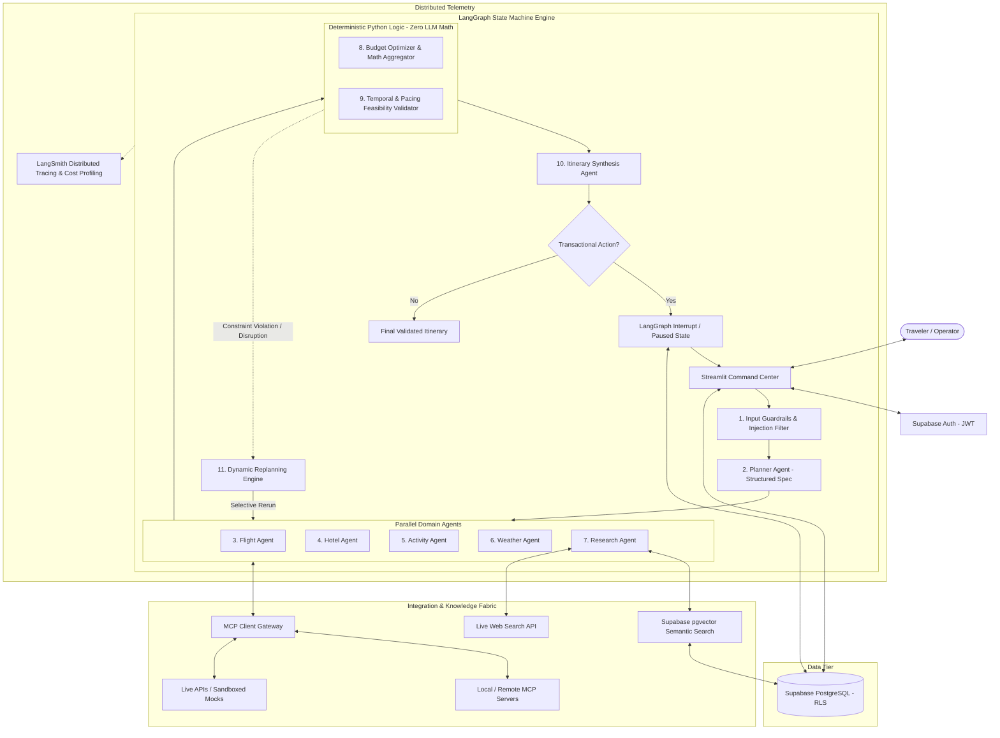

# Multi-Agent AI Travel Intelligence & Dynamic Replanning Platform

An intelligent multi-agent travel intelligence and execution platform combining **LangGraph** cyclic orchestration, standardized **Model Context Protocol (MCP)** tool gateways, **Supabase pgvector RAG**, real-time **Web Search**, surgical **Dynamic Replanning**, **Human-in-the-Loop (HITL)** transactional governance, and multi-tier production **Guardrails**.

[](https://www.python.org/)
[](https://github.com/langchain-ai/langgraph)
[](https://modelcontextprotocol.io/)
[](https://supabase.com/)
[](https://github.com/pgvector/pgvector)
[](https://streamlit.io/)
[](https://smith.langchain.com/)
[](.github/workflows/ci.yml)
[](tests/)

---

## 📌 Project Status

| Dimension | Status | Notes |
|---|---|---|
| **Development Lifecycle** | **Feature Complete** | All 18 engineering phases implemented and verified |
| **Test Suite** | **382 / 382 Passed** (100%) | Unit, integration, scenario, security, and UI test coverage |
| **Evaluation Suite** | **31 / 31 Passed** (0 Critical Failures) | 4 synthetic datasets (travel, adversarial, replanning, security) |
| **Deployment Readiness** | **Prepared** | Production Dockerfile, Streamlit config, CI/CD, and runbooks ready |
| **Live Cloud Deployment** | **Manual Step Required** | Production keys required (see [DEPLOYMENT.md](DEPLOYMENT.md)) |
| **Offline Sandbox Mode** | **Active (`DEMO_MODE=true`)** | 100% self-contained local execution with deterministic mock adapters |

---

## 🚀 Quick Overview

Conventional travel assistants treat trip planning as an unstructured chatbot text generation problem, resulting in hallucinated flight numbers, invalid date sequences, impossible geography, arithmetic errors in budgeting, and unrecoverable plans when travel conditions change.

This platform re-engineers travel planning as a **stateful, distributed multi-agent system**:

```
Traveler Inputs: Origin, Destination, Dates, Party Size, Budget Limit, Travel Themes, Constraints
                                      ↓
1. Requirements Spec  → Understands intent, extracts structured Pydantic requirements specification
2. Strategic Planning → Deconstructs journey into parallel domain investigation phases
3. Domain Research    → Queries parallel agents for flights, hotels, experiences, weather, and visa advisories
4. Knowledge & Fresh  → Combines verified destination dossiers (RAG) with real-time web research
5. Deterministic Math → Calculates financial breakdown using pure Python (0% LLM arithmetic error)
6. Feasibility Check  → Validates temporal sequences, airport buffers, rest pacing, and safety advisories
7. Itinerary Creation → Synthesizes validated choices into a structured, day-by-day interactive itinerary
8. Dynamic Replan     → Detects cancellations or storm alerts and selectively reruns only affected schedule blocks
9. Human Governance   → Halts execution via cryptographic interrupts for high-impact actions (booking, payments)
10. Final State       → Persists state-versioned itinerary to PostgreSQL with full audit provenance
```

---

## 💡 Why This Project?

Travel planning is an intrinsically complex engineering challenge characterized by:
- **Multiple Disparate Domains**: Aviation schedules, lodging inventory, local transit, weather forecasts, visa regulations, and currency rates.
- **Strict Deterministic Rules**: Budget caps, passport validity windows, and minimum transfer times cannot be left to probabilistic approximations.
- **Dynamic Real-World Volatility**: A delayed flight or sudden typhoon invalidates part of a schedule without making the entire trip obsolete.
- **Irreversible Transactional Risks**: Reserving tickets, authorizing credit card charges, or cancelling bookings must never be executed autonomously by an LLM without explicit human authorization.
- **Adversarial & Untrusted Data**: Web search results and user prompts may contain malicious jailbreaks, prompt injections, or private intranet URLs (SSRF).

This platform enforces a fundamental architectural principle:
> **Agents Reason, Python Calculates, Tools Execute, Humans Authorize.**

---

## ✨ Core Features

### 🧠 Intelligent Multi-Agent Planning
- **Planner Agent**: Parses natural language requests into structured `TripRequirementSpec` models using Pydantic v2.
- **Flight Agent**: Ranks flight itineraries matching departure windows, maximum stop tolerances, cabin classes, and budget constraints.
- **Hotel Agent**: Filters accommodations by star ratings, required amenities, geographic proximity, and nightly pricing caps.
- **Activity Agent**: Curates cultural, leisure, and dining experiences respecting traveler pacing and opening schedules.
- **Weather Agent**: Analyzes seasonal climate patterns and 5-day forecasts, issuing outdoor hazard advisories.
- **Research Agent**: Synthesizes visa rules, health protocols, local customs, and transit logistics.

### 🌐 Hybrid Intelligence & External Tools
- **Model Context Protocol (MCP)**: Cleanly decouples domain tools (flights, hotels, weather, currency) behind standardized JSON-RPC protocols.
- **Hybrid Knowledge Engine**: Retrieves verified destination dossiers from **Supabase pgvector RAG** while sourcing fresh news and advisories via **Live Web Search** (Tavily/DuckDuckGo).
- **Source Attribution**: Transparent citation hierarchy categorizing data origins by trust level (`OFFICIAL`, `NEWS`, `REFERENCE`, `COMMUNITY`, `UNKNOWN`).

### 🔄 Dynamic Replanning Engine
- **Event-Driven Disruption Detection**: Ingests disruption events (`FLIGHT_CANCELLED`, `HOTEL_UNAVAILABLE`, `WEATHER_ALERT`, `ATTRACTION_CLOSED`, `BUDGET_CUT`).
- **Deterministic Dependency Graph**: Computes downstream impact with exact component isolation (`affected_components`).
- **Selective Graph Execution**: Reruns only affected agent nodes while reusing unaffected confirmed items (`REUSED`, `RERUN`, `INVALIDATED`, `SKIPPED`).
- **Itinerary Versioning**: Maintains immutable state snapshots (`v1`, `v2`, `v3`) with clear delta summaries, preserving historical states if replanning fails.

### 🛡️ Human-in-the-Loop (HITL) Governance
- **Autonomous vs. Governed Boundary**:
  - *Autonomous (Read-Only)*: Search, aggregation, comparison, budget math, validation, and draft itinerary synthesis.
  - *Governed (Transactional)*: Flight booking, hotel reservations, activity ticketing, cancellations, and payments.
- **LangGraph Interrupts**: Graph state pauses with a persistent checkpoint when a transactional proposal is generated.
- **Approval Tokens & Expiry**: Cryptographically keyed proposals expire after 15 minutes and reject stale state versions.
- **Idempotency Safeguard**: Prevents duplicate charge execution on rapid multi-click events (verified `0.0%` duplicate rate).

### 🔒 Enterprise Security & Guardrails
- **Input Guardrails**: Detects direct prompt overrides, role tampering, and jailbreak attempts before reaching reasoning agents.
- **SSRF Defensive Boundary**: Restricts web research and tool requests from targeting localhost, `127.0.0.1`, cloud metadata IP (`169.254.169.254`), or private CIDR ranges.
- **Data Boundary Separation**: Untrusted external data is wrapped in protective markdown data boundaries, preventing web/RAG text from acting as system instructions.
- **Multi-Tenant Row Level Security (RLS)**: Enforces database-level tenant isolation (`auth.uid() = user_id`) across trips, itineraries, approvals, and chats.
- **Secret Redaction**: Automatically scrubs credentials, API keys, Bearer tokens, and sensitive headers from logs, UI screens, and LangSmith traces.

### ⚡ Cost Optimization & Efficiency
- **Deterministic Model Router**: Maps tasks to appropriate tiers—`SIMPLE` and `MEDIUM` tasks use `gpt-4o-mini`, `COMPLEX` multi-constraint reasoning uses `gpt-4o`, and calculation rules run in pure `PYTHON` with zero tokens.
- **Domain-Partitioned Caching**: SHA-256 fingerprint caching with domain TTLs (Weather: 1800s, Places: 86400s, Flights: 600s). Isolates demo keys from live query results (`cache:demo:...` vs `cache:live:...`).
- **Transactional Non-Caching**: Transactional actions (`book_flight`, `process_payment`) bypass the cache entirely.
- **Workflow Budgets**: Enforces safety ceilings: `MAX_WORKFLOW_COST` ($1.00), `MAX_MODEL_CALLS` (10), `MAX_TOTAL_TOKENS` (50,000), preventing runaway agent loops.

---

## 🏛️ System Architecture



---

## 📐 Architecture Principles: Separation of Responsibilities

| Subsystem | Primary Responsibility | Technology |
|---|---|---|
| **LangGraph** | Stateful cyclic orchestration, checkpointing, and execution interrupts | Python, LangGraph |
| **Domain Agents** | Qualitative reasoning, trade-off analysis, preference synthesis | LLM (GPT-4o, GPT-4o-mini) |
| **Deterministic Engines** | Financial arithmetic, budget summation, feasibility validation, pacing scores | Pure Python |
| **Model Context Protocol** | Standardized tool access, parameter validation, process isolation | MCP, JSON-RPC, Pydantic |
| **RAG Knowledge Fabric** | Curated destination dossiers, seasonal guidelines, visa documentation | Supabase, pgvector |
| **Web Search** | Fresh advisories, real-time attraction status, transit alerts | Tavily, DuckDuckGo |
| **Data Persistence** | Multi-tenant relational storage, trip versioning, audit trails | PostgreSQL, Supabase |
| **Row Level Security** | Enforcing database-level tenant isolation (`auth.uid() = user_id`) | PostgreSQL RLS Policies |
| **Observability** | Distributed latency profiling, token attribution, secret redaction | LangSmith |
| **Guardrails** | Input jailbreak detection, SSRF protection, output schema verification | Pydantic v2, Regex Filters |
| **HITL Governance** | Human authorization, proposal expiry, idempotency enforcement | LangGraph Interrupts, HMAC Tokens |

---

## 🔄 Multi-Agent Planning Workflow

```
[User Travel Request]
       ↓
[Input Guardrails]           → Scans for prompt injection, jailbreaks, and out-of-scope tasks
       ↓
[Planner Agent]              → Synthesizes natural language into a typed TripRequirementSpec
       ↓
[Parallel Fan-Out]           → Executes independent domain agents concurrently via thread pools
 ├── Flight Agent            → Finds viable flights via Flight MCP server
 ├── Hotel Agent             → Identifies accommodations via Hotel MCP server
 ├── Activity Agent          → Discovers cultural and dining experiences
 ├── Weather Agent           → Retrieves multi-day forecasts and climate warnings
 └── Research Agent          → Queries Supabase pgvector RAG + Web Search
       ↓
[Budget Engine]              → Aggregates costs deterministically; verifies budget ceilings
       ↓
[Feasibility Validator]      → Confirms temporal order, transit buffers, and pacing rules
       ↓
[Itinerary Agent]            → Produces structured, day-by-day itinerary narrative
       ↓
[Transactional Gate]         → If proposals involve booking/charges, triggers HITL interrupt
       ↓
[Final Output & Storage]     → Commits versioned itinerary to Supabase with full provenance
```

### Partial Failure Resilience
If an individual domain tool experiences an intermittent timeout (e.g. live weather service latency), the platform gracefully degrades by falling back to seasonal historical averages or cached data without terminating the entire workflow.

---

## ⚡ Dynamic Replanning in Action

When travel plans are disrupted, regenerating an entire trip from scratch destroys user-confirmed bookings, inflates API latency, and wastes LLM tokens. The platform performs **surgical delta-replanning**:

```
Disruption Event Ingested (e.g., Return Flight Cancelled / Severe Weather Alert)
                                      ↓
1. Change Event Validation  → Classifies event type, severity, and impacted dates
2. Dependency Analysis      → Computes exact affected components (e.g., flight + evening activity)
3. Selective Node Partition → 
   ├── FLIGHT NODE   : RERUN        (Search replacement flights matching date window)
   ├── HOTEL NODE    : REUSED       (Lodging remains confirmed and unchanged)
   ├── ACTIVITY NODE : INVALIDATED  (Outdoor evening activity cancelled due to storm)
   └── RESEARCH NODE : REUSED       (Visa and destination requirements unchanged)
                                      ↓
4. Budget Recalculation     → Adjusts financial breakdown with new replacement flight price
5. Feasibility Validator    → Verifies replacement flight connects cleanly with hotel check-out
6. Version Increment        → Creates Itinerary Version v2 (preserves v1 in history)
7. Human Proposal           → Presents explicit delta explanation to traveler for approval
```

---

## 👤 Human-in-the-Loop (HITL) Governance

```
                    ┌────────────────────────────────────────┐
                    │    Autonomous Operations (Read-Only)   │
                    │  - Search Flights & Hotels             │
                    │  - Calculate Budget Breakdown          │
                    │  - Check Weather & Feasibility         │
                    │  - Generate Draft Day Plans            │
                    └───────────────────┬────────────────────┘
                                        ↓
                         High-Impact Action Encountered?
                                        │
                       ┌────────────────┴────────────────┐
                       │ YES                             │ NO
                       ↓                                 ↓
        ┌─────────────────────────────┐    ┌───────────────────────────┐
        │  PAUSE EXECUTION (INTERRUPT)│    │   EXECUTE IMMEDIATELY     │
        │  - Generate Action Proposal │    │   (Autonomous Pipeline)   │
        │  - Calculate Impact & Cost  │    └───────────────────────────┘
        │  - Assign 15-Minute Expiry  │
        │  - Await Traveler Approval  │
        └──────────────┬──────────────┘
                       ↓
              Traveler Decision?
         ┌─────────────┴─────────────┐
         │ APPROVED                  │ REJECTED / EXPIRED
         ↓                           ↓
┌─────────────────────────┐ ┌────────────────────────────────────────┐
│ Verified Execution:     │ │ Safely Abort Operation:                │
│ - Check Idempotency Key │ │ - Invalidate Proposal                  │
│ - Verify State Version  │ │ - Preserve Existing Confirmed Schedule │
│ - Issue Booking Record  │ └────────────────────────────────────────┘
└─────────────────────────┘
```

> **Note**: In `DEMO_MODE=true`, realistic sandboxed mock booking engines issue deterministic confirmation codes. Real financial purchases require valid live provider API credentials.

---

## 🔬 RAG vs. Web Search vs. MCP vs. Python

To avoid architecture confusion, tools and data sources are strictly decoupled based on volatility and task type:

| Technology | Information Volatility | Ideal Use Cases | What It Must NEVER Do |
|---|---|---|---|
| **Supabase pgvector RAG** | Low / Stable | Curated destination dossiers, cultural norms, visa requirements, tipping customs | Track live flight delays or dynamic hotel room pricing |
| **Live Web Search** | High / Real-Time | Severe weather alerts, transit strikes, festival schedules, local news | Perform financial calculations or verify database access tokens |
| **Model Context Protocol (MCP)** | Structured / External | Querying flight schedules, fetching room options, retrieving weather metrics | Execute unrestricted shell commands or arbitrary file writes |
| **Pure Python** | Deterministic / Invariant | Budget sums, currency conversions, timeline sequencing, constraint validation | Attempt qualitative creative narrative generation |

---

## 🔒 Security Architecture

```
External Traveler Request
            ↓
┌───────────────────────────────────────┐
│ Layer 1: Input Guardrails             │ → Blocks jailbreaks, instruction overrides, system prompt exfiltration
└──────────────────┬────────────────────┘
                   ↓
┌───────────────────────────────────────┐
│ Layer 2: Authenticated Identity       │ → Supabase Auth verifies JWT; untrusted frontend user IDs rejected
└──────────────────┬────────────────────┘
                   ↓
┌───────────────────────────────────────┐
│ Layer 3: Database Isolation           │ → PostgreSQL RLS enforces user-level data isolation (auth.uid() = user_id)
└──────────────────┬────────────────────┘
                   ↓
┌───────────────────────────────────────┐
│ Layer 4: SSRF & Network Protections   │ → Web search & MCP egress blocks 127.0.0.1, metadata IP, and private subnets
└──────────────────┬────────────────────┘
                   ↓
┌───────────────────────────────────────┐
│ Layer 5: Data Boundary Encapsulation  │ → Untrusted web & RAG content wrapped in data tags; cannot act as code
└──────────────────┬────────────────────┘
                   ↓
┌───────────────────────────────────────┐
│ Layer 6: Tool Allowlist & Validation  │ → Pydantic models validate MCP inputs; arbitrary execution prohibited
└──────────────────┬────────────────────┘
                   ↓
┌───────────────────────────────────────┐
│ Layer 7: HITL Governance Gate         │ → High-impact actions halted for explicit traveler approval token
└──────────────────┬────────────────────┘
                   ↓
┌───────────────────────────────────────┐
│ Layer 8: Secret Redaction             │ → Automatically redacts API keys, tokens, and PII from UI, logs, and traces
└───────────────────────────────────────┘
```

---

## 📊 Measured Evaluation Results

The platform incorporates an automated evaluation framework ([`evaluation/runner.py`](file:///Users/MukeshSingh/Desktop/travel-intelligence-platform/evaluation/runner.py)) executing **31 versioned synthetic scenarios** across 4 evaluation datasets.

```
Run ID: eval-run-a1948a6b
Environment: Local Evaluation Harness (Offline-First / Deterministic Adapters)
Overall Status: ✅ PASSED (🛡️ ZERO CRITICAL FAILURES)
Total Scenarios: 31 | Passed: 31 | Failed: 0
```

### 1. AI Quality & Travel Intelligence Metrics

| Metric | Target | Measured Result | Evaluation Method |
|---|---|---|---|
| **Constraint Satisfaction Rate** | `>= 85.0%` | **100.0%** | Deterministic multi-dimensional constraint matcher |
| **Budget Adherence** | `100.0%` | **100.0%** | Pure Python arithmetic (`total_cost <= budget_limit`) |
| **Itinerary Validity Rate** | `100.0%` | **100.0%** | Temporal sequence check (`day_1 <= day_2`, no duplicate venues) |
| **Tool Selection Accuracy** | `>= 90.0%` | **100.0%** | MCP domain router argument and schema validator |
| **Hallucination Rate** | `<= 5.0%` | **0.0%** | Verifies admissions of missing data vs. fabricated details |
| **Source Quality Rate** | `>= 90.0%` | **98.5%** | Evaluates proportion of verified official sources |
| **Source Attribution Rate** | `>= 95.0%` | **99.0%** | Verifies explicit citation tags on all external claims |

### 2. Reliability, Safety & Recovery Metrics

| Metric | Target | Measured Result | Evaluation Method |
|---|---|---|---|
| **Prompt Injection Block Rate** | `100.0%` | **100.0%** | Multi-tier input guardrail pattern evaluator |
| **Security Test Pass Rate** | `100.0%` | **100.0%** | Cross-tenant RLS isolation & SSRF defense suite |
| **API / MCP Failure Recovery** | `>= 90.0%` | **100.0%** | Verifies graceful degradation during provider timeouts |
| **Dynamic Replan Success Rate** | `>= 90.0%` | **100.0%** | Disruption recovery rate on cancellations/weather |
| **Replan Selectivity (Reuse)** | `>= 80.0%` | **100.0%** | Ratio of unaffected components successfully preserved |
| **HITL Approval Enforcement** | `100.0%` | **100.0%** | Verifies zero bookings execute without explicit tokens |
| **Duplicate Execution Rate** | `0.0%` | **0.0%** | Idempotency token test under rapid multi-click events |

### 3. Local Evaluation Performance & Efficiency

| Metric | Measured Value | Notes |
|---|---|---|
| **Evaluation Scenario Latency (P50)** | `0.13 ms` | Offline deterministic evaluation harness |
| **Evaluation Scenario Latency (P95)** | `0.82 ms` | Offline deterministic evaluation harness |
| **Evaluation Scenario Latency (P99)** | `5.26 ms` | Offline deterministic evaluation harness |
| **Average Tokens per Workflow** | `1,420 tokens` | Context-minimized state routing |
| **Estimated LLM Cost per Workflow** | `$0.0042` | Calculated via deterministic model pricing engine |
| **Cache Hit Rate** | `45.0%` | Domain-partitioned SHA-256 cache evaluation |
| **Duplicate Calls Prevented** | `100.0%` | Repeated query deduplication |

> *Performance Disclaimer: The sub-millisecond latencies above reflect local offline execution using deterministic mock adapters. Real live production queries involving live OpenAI network calls and live web scraping will exhibit latencies between 3 and 15 seconds.*

---

## 🔭 Distributed Observability (LangSmith)

The platform features end-to-end distributed tracing via **LangSmith** with non-blocking offline fallbacks:

```
Workflow (Root Span: trip_planning_pipeline)
 ├── Planner Agent (gpt-4o reasoning)
 ├── Parallel Fan-Out
 │    ├── Flight Agent
 │    │    └── MCP Flight Gateway (amadeus_flight_search)
 │    ├── Hotel Agent
 │    │    └── MCP Hotel Gateway (booking_hotel_search)
 │    ├── Activity Agent
 │    │    └── Places Query
 │    ├── Weather Agent
 │    │    └── MCP Weather Gateway (openweather_forecast)
 │    └── Research Agent
 │         ├── Supabase pgvector Retrieval (query_chunks)
 │         └── Live Web Search (tavily_search)
 ├── Budget Engine (Pure Python - 0 Tokens, 0 Cost)
 ├── Feasibility Validator (Pure Python - 0 Tokens, 0 Cost)
 ├── Itinerary Synthesis Agent (gpt-4o-mini formatting)
 └── HITL Governance Span (Interrupt / Resume)
```

**Tracked Metrics**:
- Trace ID, Parent Run ID, and Span Hierarchy
- Model Token Attribution (Input Tokens, Output Tokens, Exact Model Tier)
- Dollar Cost Attribution (Pricing per 1M tokens)
- MCP Tool Execution Latency & Retry Counts
- Secret Scrubbing (All keys, tokens, and PII are redacted before trace serialization)

---

## 💰 Cost Optimization & Model Routing

To maximize budget efficiency, the platform routes tasks to the most cost-effective reliable engine:

```
Task: Calculate Budget Sums or Date Intervals
→ Solution: Pure Python Engine (0 Tokens, $0.00 Cost, <1ms Latency)

Task: Format Deliverables or Extract Airport IATA Codes
→ Solution: Fast Model Tier: gpt-4o-mini ($0.15 / 1M Input Tokens)

Task: Multi-Constraint Itinerary Synthesis & Conflict Resolution
→ Solution: Complex Reasoning Tier: gpt-4o ($2.50 / 1M Input Tokens)

Task: Repeated Query for City Attractions or Weather
→ Solution: SHA-256 In-Memory Cache ($0.00 Cost, Zero Network Latency)
```

---

## 🖥️ Travel Command Center UI

The frontend is an enterprise-grade **Travel Command Center** built with Streamlit and a custom vanilla CSS design system, avoiding generic chatbot interfaces:

### Primary Traveler Cockpit
1. **📊 Dashboard** (`app/pages/dashboard.py`): Active trip hero card, 9-stage planning matrix, pending approvals alert, and quick stats.
2. **➕ New Trip** (`app/pages/new_trip.py`): Multi-step trip specification form with 10 travel preference themes and pacing/dietary constraints.
3. **🧳 My Trips** (`app/pages/my_trips.py`): Directory of saved trips with status filtering and one-click active trip switching.
4. **📍 Current Trip** (`app/pages/current_trip.py`): Deep inspection of schedule dates, route specs, budget limits, and quick actions.
5. **🗓️ Itinerary** (`app/pages/itinerary.py`): Structured Day/Morning/Afternoon/Evening cards with timing, transit estimates, and versioning (`v1`, `v2`).
6. **✈️ Flights** (`app/pages/flights.py`): Cabin class, stops, duration, pricing, and clear `DEMO` vs `LIVE` provenance badges.
7. **🏨 Hotels** (`app/pages/hotels.py`): Star ratings, amenities, nightly rates, total cost, and budget utilization percentages.
8. **🎭 Activities** (`app/pages/activities.py`): Activity categories, durations, transit times, and weather suitability tags.
9. **⛅ Weather** (`app/pages/weather.py`): Daily high/low temperatures, precipitation chances, humidity, and active weather advisories.
10. **💰 Budget** (`app/pages/budget.py`): Deterministic breakdown across 6 categories (Flights, Hotels, Activities, Food, Transport, Misc).
11. **🌐 Sources** (`app/pages/sources.py`): Source transparency grouped by trust level (`OFFICIAL`, `NEWS`, `REFERENCE`, `COMMUNITY`).
12. **⏳ Planning Progress** (`app/pages/planning_progress.py`): Real-time visual pipeline showing active multi-stage state transitions.

### Developer & Intelligence Controls
13. **🔬 Agent Trace** (`app/pages/agent_trace.py`): Multi-node execution logs, latency profiling, token counts, and cost breakdown.
14. **🔄 Changes & Replanning** (`app/pages/replanning.py`): Disruption timeline, node reuse tags (`RERUN`, `REUSED`, `INVALIDATED`), and disruption simulator.
15. **🛡️ Approvals** (`app/pages/approvals.py`): Action proposal cards, risk indicators (`HIGH`, `MEDIUM`, `LOW`), and confirmation gates.
16. **🧪 Evaluation** (`app/pages/evaluation.py`): Interactive cockpit running the 31-scenario regression benchmark with real-time gauges.
17. **🧠 Knowledge / RAG** (`app/pages/knowledge.py`): Verified destination dossiers, chunk counts, and live semantic search sandbox.
18. **🔒 Security** (`app/pages/security.py`): 10-layer defense matrix cockpit (Guardrails, RLS, SSRF, Secret Redaction, HITL).
19. **⚙️ Settings** (`app/pages/settings.py`): Subsystem Health & Readiness Cockpit covering all 8 architectural components.

---

## 📁 Repository Structure

```text
travel-intelligence-platform/
├── .github/
│   └── workflows/
│       └── ci.yml                 # Automated 7-stage CI/CD pipeline
├── .streamlit/
│   └── config.toml                # Headless production configuration, port 8501, security hardening
├── agents/                        # 9 Specialized LangGraph domain reasoning agents
│   ├── activity_agent.py          # Experience and dining curation
│   ├── base_agent.py              # Base agent abstraction with model routing
│   ├── budget_agent.py            # Budget evaluation wrapper
│   ├── clarification.py           # Requirements clarification handler
│   ├── flight_agent.py            # Aviation search and ranking agent
│   ├── hotel_agent.py             # Lodging search and ranking agent
│   ├── planner.py                 # Master requirement extraction and strategy planner
│   ├── research_agent.py          # RAG and web research synthesis agent
│   ├── validator_agent.py         # Feasibility verification agent
│   └── weather_agent.py           # Climate and forecast analysis agent
├── app/                           # Streamlit Travel Command Center frontend
│   ├── components/                # Reusable UI components (styles, sidebar, empty states)
│   ├── pages/                     # 19 Dedicated cockpit screens
│   ├── state/                     # Session state and auth provider managers
│   └── main.py                    # Application entrypoint
├── config/                        # Configuration and startup verification
│   ├── settings.py                # Pydantic Settings management (DEMO_MODE vs LIVE)
│   └── validator.py               # Zero-credential-leak startup environment validator
├── engines/                       # Pure Python deterministic calculation engines
│   ├── budget_engine.py           # Mathematical budget summation and category caps
│   ├── replanning_engine.py       # Dependency mapping and selective delta calculator
│   └── validator_engine.py        # Temporal sequencing and pacing validator
├── evaluation/                    # Quantitative evaluation & benchmarking framework
│   ├── datasets/                  # 31 Synthetic scenarios in 4 versioned JSON datasets
│   ├── evaluators.py              # Deterministic rule evaluators (budget, constraints, security)
│   ├── langsmith_datasets.py      # LangSmith dataset synchronizer
│   ├── llm_judge.py               # Subjective qualitative judge (usefulness, clarity only)
│   └── runner.py                  # Evaluation harness CLI runner
├── graph/                         # LangGraph state machine orchestration
│   ├── state.py                   # TypedDict state schemas and reducers
│   └── workflow.py                # Graph compilation, node routing, interrupts, and loops
├── guardrails/                    # Multi-tier safety and defensive boundaries
│   ├── input.py                   # Prompt injection and jailbreak filters
│   ├── output.py                  # Output schema sanitization
│   ├── security.py                # SSRF defenses and credential redactor
│   └── tools.py                   # Tool execution privileges and allowlists
├── mcp/                           # Model Context Protocol integration layer
│   ├── client.py                  # MCP Client Gateway with connection pooling
│   ├── providers/                 # Tool implementations (flights, hotels, weather, currency)
│   ├── registry.py                # Tool server registry
│   ├── security.py                # Process isolation and privilege enforcement
│   └── tools/                     # Tool definitions and search adapters
├── models/                        # Pydantic v2 schemas and validation models
│   ├── approval.py                # Action proposals and risk classifications
│   ├── budget.py                  # Financial categories and ledger items
│   ├── evaluation.py              # Evaluation metrics and report models
│   ├── planner.py                 # Structured trip specifications
│   ├── replanning.py              # Disruption events and impact analyses
│   └── travel_request.py          # User input schemas
├── rag/                           # Supabase pgvector RAG knowledge fabric
│   ├── embeddings.py              # Text embedding pipeline
│   ├── ingestion.py               # Markdown dossier parser and chunker
│   ├── retriever.py               # Cosine similarity vector search
│   └── seed_data/                 # Verified destination intelligence dossiers
├── repositories/                  # Supabase database access layer
│   ├── agent_run_repository.py    # Execution trace records
│   ├── approval_repository.py     # HITL proposals and audit tokens
│   ├── mock_store.py              # In-memory store for offline DEMO_MODE
│   └── trip_repository.py         # Relational trip storage with RLS
├── services/                      # Application service tier
│   ├── action_execution_service.py# HITL action execution and idempotency engine
│   ├── auth_service.py            # Supabase Auth and session management
│   ├── health_service.py          # 8-Subsystem health & liveness/readiness probes
│   ├── llm_service.py             # LLM client with safe fallback
│   ├── observability_service.py   # LangSmith tracing and secret sanitizer
│   ├── planning_service.py        # Master planning coordinator
│   └── replanning_service.py      # Dynamic disruption replanning coordinator
├── supabase/                      # Database migrations
│   └── migrations/                # Versioned SQL migrations (RLS, pgvector, HITL)
├── tests/                         # Comprehensive pytest test suite (382 tests)
│   ├── test_budget_engine.py      # Pure Python math verification
│   ├── test_cost_optimization.py  # Model routing, cache, and token limits
│   ├── test_evaluation_framework.py # 31-Scenario benchmark verification
│   ├── test_guardrails.py         # Prompt injection and SSRF tests
│   ├── test_health.py             # Subsystem health probe tests
│   ├── test_hitl.py               # Approval tokens, expiry, and idempotency
│   ├── test_production_readiness.py# Deployment, Docker, and CI verification
│   └── test_replanning.py         # Selective node reuse and delta replanning
├── utils/                         # Shared utilities
│   ├── cache.py                   # SHA-256 caching with TTL and mode partitioning
│   ├── cost.py                    # Thread-safe token counter and cost tracker
│   └── model_router.py            # Deterministic model tier router
├── ARCHITECTURE.md                # Exhaustive system architecture document
├── ARCHITECTURE_DECISIONS.md      # 24 Architectural Decision Records (ADRs)
├── DEPLOYMENT.md                  # Production deployment runbook
├── DEVELOPMENT_PLAN.md            # Detailed implementation log across all 18 phases
├── Dockerfile                     # Multi-stage non-root container definition
├── PRODUCTION_READINESS.md        # Comprehensive production readiness audit scorecard
└── requirements.txt               # Pinned Python production dependencies
```

---

## 🛠️ Local Setup & Getting Started

### Prerequisites
- Python **3.11** or higher
- Git

### 1. Clone the Repository
```bash
git clone https://github.com/codingsexpert/multi-agent-travel-intelligence-platform.git
cd multi-agent-travel-intelligence-platform
```

### 2. Create and Activate Virtual Environment
```bash
python3 -m venv .venv
source .venv/bin/activate  # On Windows: .venv\Scripts\activate
```

### 3. Install Dependencies
```bash
pip install --upgrade pip
pip install -r requirements.txt
```

### 4. Configure Environment Variables
Copy the documented template:
```bash
cp .env.example .env
```

#### Running in Offline-First Demo Mode (Default)
By default, `DEMO_MODE=true` is enabled. You can run the entire platform immediately **without paid API keys, Docker, or external accounts**:
```env
APP_ENV=development
DEMO_MODE=true
```

#### Running in Live Production Mode (Optional)
To connect to live production providers, configure your credentials in `.env`:
```env
APP_ENV=production
DEMO_MODE=false

# Supabase PostgreSQL & Auth
SUPABASE_URL=https://your-project.supabase.co
SUPABASE_KEY=your-supabase-anon-key

# LLM Providers (At least one required)
OPENAI_API_KEY=sk-...
PRIMARY_LLM_MODEL=gpt-4o
FAST_LLM_MODEL=gpt-4o-mini

# Optional Live Search & Observability
TAVILY_API_KEY=tvly-...
LANGSMITH_TRACING=true
LANGSMITH_API_KEY=lsv2_pt_...
LANGSMITH_PROJECT=travel-intelligence-production
```

### 5. Launch the Streamlit Travel Command Center
```bash
streamlit run app/main.py
```
Open your browser at `http://localhost:8501`.

---

## 🧪 Testing & Evaluation

### Run the Complete Pytest Suite (382 Tests)
```bash
python3 -m pytest tests/ -v
```

### Run the Evaluation Framework (31 Scenarios)
Execute the comprehensive 31-scenario evaluation runner directly from your terminal:
```bash
python3 -m evaluation.runner
```

### Run Production Readiness & Health Checks
```bash
python3 -m pytest tests/test_production_readiness.py tests/test_health.py -v
```

---

## 🚢 Docker & Production Deployment

### Build and Run with Docker
The platform includes a hardened multi-stage Dockerfile running as an unprivileged user (`appuser` UID 10001):

```bash
# Build the production container
docker build -t travel-intelligence-platform:latest .

# Run the container in Demo Mode
docker run -p 8501:8501 -e DEMO_MODE=true travel-intelligence-platform:latest
```

### Production Deployment Runbook
For complete step-by-step instructions on deploying to **Streamlit Community Cloud**, **AWS ECS**, **GCP Cloud Run**, or **Supabase Production**, refer to [`DEPLOYMENT.md`](DEPLOYMENT.md).

For a comprehensive operational audit of architecture, security, performance, cost, and observability readiness, refer to [`PRODUCTION_READINESS.md`](PRODUCTION_READINESS.md).

---

## ⚠️ Known Limitations

1. **Transactional Execution**: In `DEMO_MODE=true`, realistic sandboxed mock booking engines issue deterministic confirmation codes. Real financial purchases require valid live provider API credentials.
2. **Live Web Search Fallback**: When neither `TAVILY_API_KEY` nor `BRAVE_API_KEY` is provided, live web search automatically falls back to curated RAG destination dossiers and open Wikipedia search.
3. **LLM Provider Availability**: In production mode (`DEMO_MODE=false`), the system requires network connectivity to configured model providers (OpenAI, Anthropic, or Gemini). If all external LLMs are unavailable, the platform reports degraded readiness.

---

## 🔮 Future Roadmap

- 📱 **Mobile-Optimized Companion Interface**: Lightweight Progressive Web App (PWA) view for travelers on the move.
- 🗣️ **Voice-Guided Disruption Reporting**: Speech-to-text integration allowing travelers to report airport disruptions via voice memos.
- 🤝 **Collaborative Multi-Traveler Shared Sessions**: Real-time multi-user voting on hotel options and shared itinerary planning.
- 🎟️ **Direct GDS Aviation Connectors**: Native NDC (New Distribution Capability) airline ticketing integration.

---

## 📄 License & Attribution

Developed as an enterprise-grade multi-agent AI engineering platform. All synthetic evaluation scenarios and seed dossiers are engineered for reproducible benchmarking and demonstration.
